# 2주차 데이터베이스 다루기 🔮


**[수업 목표]**

- 이 섹션에서는 내장형 H2 데이터베이스를 설치하고 설정하는 방법을 배웁니다. H2 데이터베이스의 주요 특징과 장점을 소개하며, 간단한 데이터베이스 생성 방법을 설명합니다.
- SQL 기본 구문을 사용하여 데이터를 생성, 조회, 수정, 삭제하는 방법을 배웁니다. 이를 통해 데이터베이스 관리의 기본이 되는 SQL 문법에 대한 이해를 높입니다.
- 데이터베이스 드라이버의 역할과 중요성을 이해하고, 적절한 드라이버 선택 및 설정 방법을 배웁니다. JDBC 드라이버를 사용하여 애플리케이션과 데이터베이스 간의 연결을 구성하는 과정을 다룹니다.
- JDBC를 통해 Java 애플리케이션에서 데이터베이스 데이터를 직접 다루는 방법을 소개합니다. Connection, Statement, ResultSet 객체의 사용법을 배우며, 간단한 CRUD 작업을 실습합니다.


## ⭐ 01. 이번 주에 배울 것
> 이 강의의 핵심을 한 줄로 정리합니다.

### 데이터베이스 다루기
- 데이터베이스 생성 `H2`
- 데이터베이스에서 데이터 다루기 `SQL`
- 데이터베이스 연결 `Driver`
- 데이터베이스 데이터를 외부에서 다루기 `JDBC`


## 🆕 **02.** 데이터베이스 생성 (H2)
> ✔️ 이 섹션에서는 내장형 H2 데이터베이스를 설치하고 설정하는 방법을 배웁니다. H2 데이터베이스의 주요 특징과 장점을 소개하며, 간단한 데이터베이스 생성 방법을 설명합니다.

### **DB(H2) 사용 방식 3가지**

>💡 H2는 Server Mode, In-memory Mode, Embeded Mode라는 세가지 방식으로 사용할 수 있습니다.

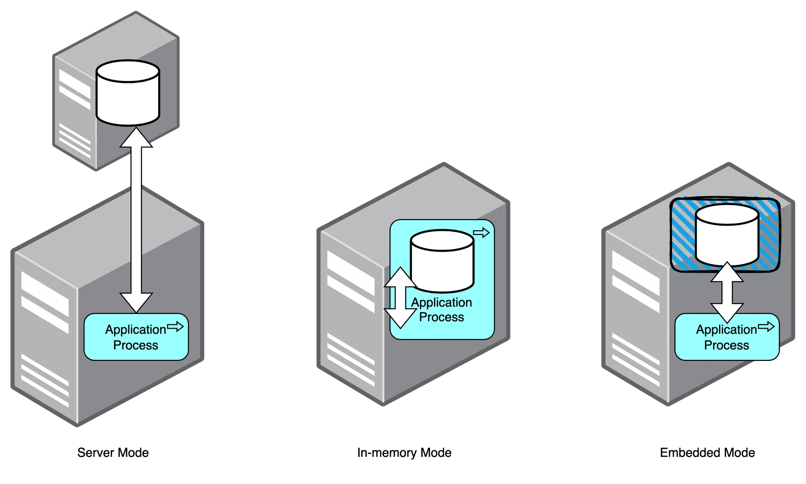

- **Server Mode**
    - 직접 엔진을 설치하여 사용하는 방식.
    - 애플리케이션과 상관 없는 외부에서 DB 엔진이 구동된다.
    - 데이터가 애플리케이션 외부에 저장되므로 애플리케이션을 종료해도 데이터가 사라지지 않는다.
- **In-memory Mode**
    - 엔진을 설치하지 않고 애플리케이션 내부의 엔진을 사용하는 방식.
        - `build.gradle` 및 `application.properties` 설정을 통해 실행 가능하다.
    - 애플리케이션을 실행하면 DB 엔진이 함께 실행되고 애플리케이션을 종료하면 DB 엔진이 함께 종료된다.
    - 데이터가 애플리케이션의 **메모리**에 저장되기 때문에 애플리케이션을 종료하면 데이터가 사라진다.
- **Embedded Mode**
    - 엔진을 설치하지 않고 애플리케이션 내부의 엔진을 사용하는 방식.
        - `build.gradle` 및 `application.properties` 설정을 통해 실행 가능하다.
    - 애플리케이션을 실행하면 DB 엔진이 함께 실행되고 애플리케이션을 종료하면 DB 엔진이 함께 종료된다.
    - 데이터가 애플리케이션 **외부**에 저장되므로 애플리케이션을 종료해도 데이터가 사라지지 않는다.

| Mode | H2 다운로드 여부 | 실행 주체 | DB 저장 위치 | 사용 용도 |
| --- | --- | --- | --- | --- |
| Server Mode | O | 외부 | 로컬(파일 시스템) | 배포 용도 |
| In-Memory Mode | X | 스프링 | 메모리 | 테스트 용도 |
| Embedded Mode | X | 스프링 | 로컬(파일 시스템) | 개발 용도 |

### 1. Server Mode

- 서버 모드는 현업에서 사용하는 모드로 컴퓨터에 DB 엔진을 설치하고 엔진을 구동하여 사용하는 방식입니다.
- 애플리케이션과 DB가 분리되어 있기 때문에 여러 애플리케이션에서 동일한 DB를 사용하기에 적합합니다.
- H2 DBMS는 아래 공식 사이트에서 다운로드 받을 수 있습니다.
https://www.h2database.com/html/main.html

### 2. In-memory Mode

- 인메모리 모드는 애플리케이션에 DB 엔진이 내장되어 애플리케이션과 함께 실행되고 종료되는 방식입니다.
- 데이터가 애플리케이션의 메모리에 저장되기 때문에 애플리케이션이 종료되면 모든 데이터가 사라지는 휘발성의 특징을 갖고 있습니다.
- 이러한 특징으로 인해 단위 테스트 등에서 많이 사용됩니다.
- 스프링부트 프로젝트에서 H2를 인메모리 모드로 사용하려면 `application.yml` 또는 `application.properties`에서 아래와 같이 설정하면 됩니다.

```yml
# application.yml
spring:  
    datasource:    
        driver-class-name: org.h2.Driver
        url: jdbc:h2:mem:{DB 이름}
        username: sa
        password:
```

```properties
# application.properties
spring.datasource.driver-class-name=org.h2.Driver
spring.datasource.url=jdbc:h2:mem:{DB 이름}
spring.datasource.username=sa
spring.datasource.password=
```
datasource의 url에는 일반적으로 DB 서버의 호스트와 포트 번호, DB 이름 등의 접속 정보를 기재하는데, **H2에서는 여기에 `mem`을 기재하여 애플리케이션이 실행되는 메모리 자체에서 DB를 사용하겠다는 것을 선언합니다.**

### 3. Embedded Mode

- 임베디드(내장) 모드는 인메모리 모드와 동일하게 애플리케이션에 DB 엔진이 내장되어 애플리케이션과 함께 실행되고 종료되는 방식입니다.
- 인메모리 모드와 다른 점은 데이터를 로컬에 저장하기 때문에 데이터 휘발에서 자유롭다는 점입니다. 이로 인해 간단한 애플리케이션에서 사용하기 좋습니다.
- 스프링부트 프로젝트에서 H2를 임베디드 모드로 사용하는 방법은 url을 제외하고 동일하게 설정해주면 됩니다.

```yml
# application.yml
spring:
  datasource:
      driver-class-name: org.h2.Driver
      url: jdbc:h2:{DB가 저장될 경로}    
      username: sa    
      password:
```

```properties
# application.properties
spring.datasource.driver-class-name=org.h2.Driver
spring.datasource.url=jdbc:h2:{DB가 저장될 경로}
spring.datasource.username=sa
spring.datasource.password=
```
위의 인메모리 모드와 차이점이라면 **`mem`이 사라지고 `jdbc:h2:`이후에 바로 DB가 저장될 경로를 입력하는 것입니다.**


## 4. 실습하기

이번 프로젝트는 Embedded Mode 로 H2 를 사용합니다. test 라는 이름의 DB를 사용하기 위해선 아래와 같이 설정해주면 됩니다.

```yml
# application.yml
spring:
  datasource:
      driver-class-name: org.h2.Driver
      url: jdbc:h2:~/test
      username: sa
      password:
```

```properties
# application.properties
spring.datasource.driver-class-name=org.h2.Driver
spring.datasource.url=jdbc:h2:~/test
spring.datasource.username=sa
spring.datasource.password=
```
- 이와 같이 설정하고 애플리케이션을 실행하면 H2 데이터베이스 파일은 사용자의 홈 디렉토리 아래에 **`test.mv.db` 파일로 저장**됩니다.
    - 여기서 **`~`는 현재 사용자의 홈 디렉토리**를 나타냅니다.
- 윈도우 환경에서 현재 사용자의 이름이 "user"라면 **데이터베이스 파일의 경로는 `C:\Users\user\test.mv.db`가 될 수 있습니다. 리눅스나 macOS 환경에서는 `/home/username/test.mv.db` 또는 `/Users/username/test.mv.db`의 형태**로 될 것입니다.

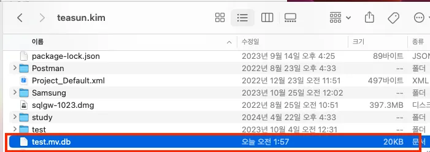

- 이 파일을 별도로 삭제하지 않는 이상 애플리케이션의 실행 여부와 관계 없이 데이터가 사라지지 않습니다.
- 브라우저에서 H2 콘솔에 접속하는 방법은 인메모리 모드와 동일합니다.
- Driver Class, JDBC URL, User Name, Password를 위의 설정 그대로 입력하면 접속되는 것을 볼 수 있습니다.

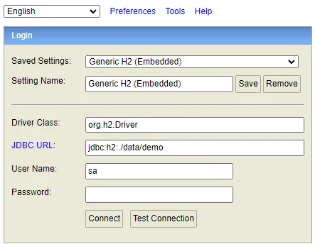

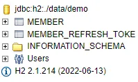
- application 설정과 동일한 정보로 H2 콘솔에 접속할 수 있습니다. (Embedded Mode)

> 💡 **In-memory Mode 를 사용하는데 h2-console 로 데이터 조회가 안돼요!!**

- **Embedded Mode** 가 아닌 **In-memory Mode** 를 사용하고 싶은데 h2-console 에서 데이터 조회가 안될 수 있습니다.
- H2 콘솔에서 데이터를 조회할 때 데이터가 보이지 않는 문제는 애플리케이션이 생성하는 데이터베이스 인스턴스와 H2 콘솔이 접근하는 데이터베이스 인스턴스가 서로 다를 때 발생할 수 있습니다.
- 이 경우, 애플리케이션과 H2 콘솔이 같은 데이터베이스 인스턴스를 사용하도록 in-memory mode 상태에서 h2 설정을 아래와 같이 바꿔줍니다
**`url: 'jdbc:h2:mem:test;DB_CLOSE_DELAY=-1;DB_CLOSE_ON_EXIT=FALSE'`**
- **DB_CLOSE_DELAY=-1**: 이 옵션은 데이터베이스를 열린 상태로 유지합니다. **`DB_CLOSE_DELAY`** 설정은 데이터베이스가 언제 닫힐지를 제어합니다. **`-1` 값**은 애플리케이션이 실행되는 동안 데이터베이스가 계속 열려 있도록 합니다.
- **DB_CLOSE_ON_EXIT=FALSE**: 이 옵션은 애플리케이션이 종료될 때 데이터베이스의 자동 종료를 방지합니다.


## 🧑‍🍳 03. 데이터베이스에서 데이터 다루기 (SQL)

> ✔️ SQL 기본 구문을 사용하여 데이터를 생성, 조회, 수정, 삭제하는 방법을 배웁니다. 이를 통해 데이터베이스 관리의 기본이 되는 SQL 문법에 대한 이해를 높입니다.


**🧑‍🍳 데이터베이스를 마치 요리하는 것처럼 생각해 볼까요?** 

재료(데이터)를 다루는 방법을 배우는 것이 이 강의의 목표입니다. 이 강의를 통해 데이터를 잘게 썰고, 조리하며, 서빙하는 방법(생성, 조회, 수정, 삭제)을 배워봅시다.

### **1. SQL 입문**

- **SQL 소개**: SQL은 마치 주방의 요리사처럼 데이터베이스 시스템을 조작하는 데 사용하는 특별한 언어입니다.
- **SQL의 종류**: 마치 레시피 북처럼, SQL은 DDL(데이터 정의 언어), DML(데이터 조작 언어), DCL(데이터 제어 언어)로 나뉩니다.

### **2. 데이터 조리 시작하기 (DDL)**

- **테이블 만들기**: **`CREATE TABLE`로** 새로운 재료함을 마련하는 방법을 배웁니다. 각 성분의 특성(열의 데이터 타입과 속성)을 어떻게 정의할까요?
- **테이블 개조하기**: **`ALTER TABLE`로** 이미 만든 재료함에 변화를 주는 방법입니다. 재료를 추가하거나 불필요한 재료를 제거해봅시다.
- **테이블 철거하기**: 사용하지 않는 재료함를 **`DROP TABLE`로** 철거하는 방법입니다.

### **3. 데이터 찾기 (DML)**

- **재료 선택하기**: **`SELECT`** 문을 사용해 필요한 재료(데이터)를 찾아보는 방법을 배웁니다. **`WHERE`** 절로 특정 조건을 만족하는 재료만 골라봅시다.
- **정렬하여 진열하기**: **`ORDER BY`로** 재료를 순서대로 정렬하고, **`GROUP BY`로** 비슷한 재료들을 그룹화하여 관리하는 방법을 배웁니다.
- **재료 합치기**: 여러 장소에서 가져온 재료를 **`JOIN`으로** 합치는 방법을 배웁니다. 조화롭게 재료를 결합하여 더 맛있는 요리를 만들어 봅시다.

### **4. 데이터 조리 및 제거 (DML)**

- **재료 추가하기**: **`INSERT INTO`로** 새로운 재료를 추가하는 방법입니다.
- **재료 업데이트하기**: **`UPDATE`로** 기존의 재료를 새로 고치는 방법입니다.
- **재료 버리기**: **`DELETE FROM`으로** 불필요한 재료를 제거하는 방법입니다.

### **5. 트랜잭션 입문**

- 데이터베이스의 상태를 변화시키기 위해서 수행하는 작업의 단위를 말합니다.
- 요리로 치면 조리대를 의미하며 재료(데이터)들을 조회하여 생성/수정/삭제 후 최종 결과물을 만들때까지 하나의 작업을 트랜잭션으로 관리 할 수 있으며, **트랜잭션은 조리(데이터 처리) 중에 문제가 발생시 그전에 했던 변경을 어떠한 일도 없었던 것처럼 모두 되돌립니다.**
    

    
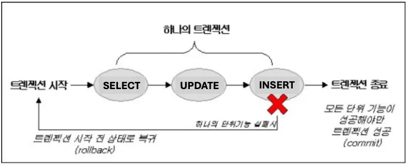
    
- 트랜잭션의 3가지 특징 (원자성, 일관성, 독립성)
1. **원자성 (All or Nothing)**
    1. 트랜잭션이 데이터베이스에 모두 반영되던가, 아니면 전혀 반영되지 않아야 한다는 것이다. 
    2.  트랜잭션은 사람이 설계한 논리적인 작업 단위로서, 일처리는 작업 단위 별로 이루어져야 사람이 다루는데 무리가 없다.
    3. 만약 트랜잭션 단위로 데이터가 처리되지 않는다면, 설계한 사람은 데이터 처리 시스템을 이해하기 힘들 뿐만 아니라, 오작동 했을시 원인을 찾기가 매우 힘들어질것이다. 
2. **일관성 (Keeps Data Correct)**
    1. 트랜잭션의 작업 처리 결과가 항상 일관성이 있어야 한다는 것이다. 
    2. 트랜잭션이 진행되는 동안에 데이터베이스가 변경 되더라도 업데이트된 데이터베이스로 트랜잭션이 진행되는 것이 아니라, 처음에 트랜잭션을 진행 하기 위해 참조한 데이터베이스로 진행된다. 
    3. 이렇게 함으로써 각 사용자는 일관성 있는 데이터를 볼 수 있는 것이다. 
3. **독립성 (Independent)**
    1. 둘 이상의 트랜잭션이 동시에 실행되고 있을 경우 어떤 하나의 트랜잭션이라도, 다른 트랜잭션의 연산에 끼어들 수 없다는 점을 가리킨다.

### **6. 트랜잭션 관리와 보안 (DCL)**

- **조리대 트랜잭션 관리**: **조리대**에서의 사고(다른 요리재료와 섞이거나, 잘못 버려지는것)를 방지하기 위해 **`BEGIN`**, **`COMMIT`**, **`ROLLBACK`으로** 트랜잭션을 관리하는 방법을 배웁니다.
- **접근 권한 설정하기**: **`GRANT`와 `REVOKE`로** 누가 주방에 들어와서 요리를 할 수 있는지를 관리하는 방법을 배웁니다.
- **`BEGIN` 이란?**
    - `START TRANSACTION` 과 동일하며 새로운 트랜잭션을 생성 및 시작하는 연산이다.
- **`COMMIT` 이란?**
    - 하나의 트랜잭션이 성공적으로 끝났고, 데이터베이스가 일관성있는 상태에 있을 때, 하나의 트랜잭션이 끝났다라는 것을알려주기위해 사용하는 연산이다. 이 연산을 사용하면 수행했던 트랜잭션이 로그에 저장되며, 후에 Rollback 연산을 수행했었던 트랜잭션단위로 하는것을 도와준다.
- **`ROLLBACK` 이란?**
    - 하나의 트랜잭션 처리가 비정상적으로 종료되어 트랜잭션의 원자성이 깨진경우, 트랜잭션을 처음부터 다시 시작하거나, 트랜잭션의 부분적으로만 연산된 결과를 다시 취소시킨다.

### 7. 쿼리 실습하기

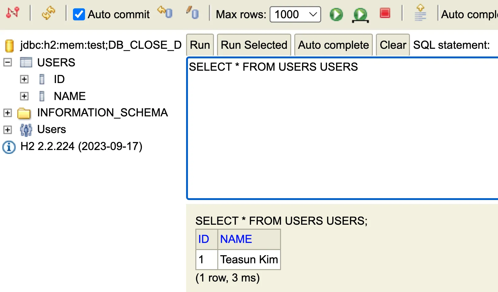

- DDL - 테이블 생성/삭제
    
    ```sql
    CREATE TABLE users (id SERIAL, name VARCHAR(255));
    
    DROP TABLE users;
    ```
    
- DML - 데이터 추가
    
    ```sql
    INSERT INTO users (name) VALUES (?)
    ```
    
- DML - 데이터 조회
    
    ```sql
    SELECT name FROM users WHERE id = ?
    ```
    
- DML - 데이터 수정
    
    ```sql
    UPDATE users SET name = ? WHERE id = ?
    ```
    
- DCL - 트랜잭션 커밋/롤백
    
    ```sql
    COMMIT
    
    ROLLBACK
    ```
    

### 8. 복잡한 쿼리 실습하기

**1. 테이블 확장**

기존 테이블

```sql
CREATE TABLE users (
    id SERIAL,
    name VARCHAR(255)
);
```

컬럼 추가

- **email**: 사용자의 이메일 주소
- **created_at**: 계정 생성 날짜
- **status**: 계정 상태 (활성/비활성)

```sql
ALTER TABLE users
ADD COLUMN email VARCHAR(255);

ALTER TABLE users
ADD COLUMN created_at TIMESTAMP DEFAULT CURRENT_TIMESTAMP;

ALTER TABLE users
ADD COLUMN status ENUM('active', 'inactive') DEFAULT 'active';

```

추가 테이블 생성

- **orders**: 사용자 주문 정보 저장 테이블
- **products**: 상품 정보 저장 테이블

```sql
CREATE TABLE products (
    id SERIAL,
    name VARCHAR(255),
    price DECIMAL(10, 2),
    PRIMARY KEY (id)
);

CREATE TABLE orders (
    id SERIAL,
    user_id BIGINT,
    product_id BIGINT,
    quantity INT,
    order_date TIMESTAMP DEFAULT CURRENT_TIMESTAMP
);

```

**2. 데이터 삽입**

users 테이블에 데이터 삽입

```sql
INSERT INTO users (name, email, status) VALUES
('Alice', 'alice@example.com', 'active'),
('Bob', 'bob@example.com', 'inactive'),
('Charlie', 'charlie@example.com', 'active');

```

products 테이블에 데이터 삽입

```sql
INSERT INTO products (name, price) VALUES
('Laptop', 1000.00),
('Phone', 500.00),
('Tablet', 300.00);

```

orders 테이블에 데이터 삽입

```sql
INSERT INTO orders (user_id, product_id, quantity) VALUES
(1, 1, 1),
(1, 2, 2),
(2, 3, 1),
(3, 1, 3);

```

**3. 쿼리 실습**

1. `WHERE` 절

- 활성 상태(`active`)인 사용자만 조회

```sql
SELECT * FROM users
WHERE status = 'active';

```

2. `JOIN`

- 사용자와 주문 내역을 함께 조회

```sql
SELECT users.name, orders.id AS order_id, products.name AS product_name, orders.quantity, orders.order_date
FROM orders
JOIN users ON orders.user_id = users.id
JOIN products ON orders.product_id = products.id;

```

3. `GROUP BY`

- 사용자별 주문 개수 집계

```sql
SELECT users.name, COUNT(orders.id) AS total_orders
FROM orders
JOIN users ON orders.user_id = users.id
GROUP BY users.name;

```

4. `ORDER BY`

- 사용자 이름으로 정렬하여 조회

```sql
SELECT * FROM users
ORDER BY name;

```

- 주문 내역을 주문 날짜 순으로 내림차순 정렬하여 조회

```sql
SELECT users.name, products.name AS product_name, orders.quantity, orders.order_date
FROM orders
JOIN users ON orders.user_id = users.id
JOIN products ON orders.product_id = products.id
ORDER BY orders.order_date DESC;

```

**4. 실습을 위한 데이터 리셋 (선택사항)**

- 데이터 초기화를 원할 경우, 다음 쿼리로 테이블 내용을 지울 수 있습니다.

```sql
TRUNCATE TABLE orders;
TRUNCATE TABLE products;
TRUNCATE TABLE users;

```

**5. 추가 연습 문제**

1. 특정 날짜 이후에 생성된 계정을 가진 사용자 조회

```sql
SELECT * FROM users
WHERE created_at > '2023-01-01';

```

2. 각 사용자별 총 주문 금액 조회

```sql
SELECT users.name, SUM(products.price * orders.quantity) AS total_spent
FROM orders
JOIN users ON orders.user_id = users.id
JOIN products ON orders.product_id = products.id
GROUP BY users.name;

```

이 자료를 통해 MySQL의 기본적인 테이블 생성, 수정, 데이터 삽입 및 다양한 쿼리 작성을 연습할 수 있습니다. 실습을 통해 SQL 쿼리에 익숙해지고 데이터를 효율적으로 관리할 수 있기를 바랍니다.

## 🪛 04. 데이터베이스 연결 (Driver)

> ✔️ 데이터베이스 드라이버의 역할과 중요성을 이해하고, 적절한 드라이버 선택 및 설정 방법을 배웁니다. JDBC 드라이버를 사용하여 애플리케이션과 데이터베이스 간의 연결을 구성하는 과정을 다룹니다.

### **1. 데이터베이스 Driver 역할 및 종류**

- **드라이버의 역할**: 데이터베이스 드라이버는 애플리케이션과 데이터베이스 간의 통신을 중개하는 역할을 합니다. 마치 우체부가 편지를 전달하는 것처럼, 드라이버는 애플리케이션의 요청을 데이터베이스가 이해할 수 있는 언어로 변환합니다.
- **드라이버의 종류**: 다양한 데이터베이스 시스템마다 호환되는 드라이버가 있습니다. 예를 들어, Oracle, MySQL, PostgreSQL 등 각 데이터베이스 제품에 맞는 특정 드라이버가 필요합니다.
    
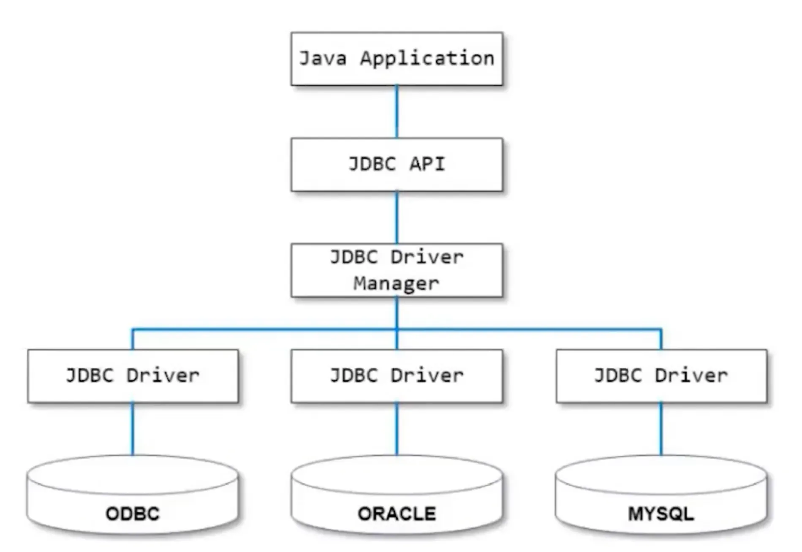

    

### 2. 데이터베이스 Driver 동작 ✈️

<aside>
📌 드라이버의 동작 방식은 마치 항공 교통 관제시스템✈️  과 비슷합니다. 항공기가 목적지에 안전하게 도착하기 위해서는 통제탑과의 지속적인 소통이 필요합니다. 마찬가지로, 데이터베이스 드라이버는 애플리케이션과 데이터베이스 간의 데이터 교환을 조절하고 관리하는 역할을 합니다.

</aside>

### **드라이버의 동작 방식**

1. **연결 초기화**
    - **요청 수신**: 애플리케이션은 데이터베이스 작업을 시작하기 위해 드라이버에 연결을 요청합니다. 이는 마치 항공편✈️ 이 이륙 허가를 받기 위해 관제탑에 요청하는 것과 유사합니다.
    - **연결 설정**: 드라이버는 데이터베이스 서버에 로그인하고 필요한 설정을 수행하여 연결을 완료합니다. 이 과정은 네트워크 정보, 인증 자격 증명 등을 사용하여 이루어집니다.
2. **SQL 전송 및 실행**
    - **SQL 명령 변환**: 애플리케이션에서 발송된 SQL 명령을 받은 드라이버는 해당 명령을 데이터베이스가 이해할 수 있는 형태로 변환합니다. 이는 외국어를 현지 언어로 번역하는 통역사의 역할과 같습니다.
    - **명령 처리**: 변환된 명령은 데이터베이스 서버로 전송되어 실행됩니다. 데이터베이스는 쿼리를 처리하고, 요구된 데이터를 검색하거나 데이터에 변화를 줍니다.
3. **결과 처리**
    - **결과 수신**: 데이터베이스에서 작업의 결과를 보내면, 드라이버는 이 결과를 받아 애플리케이션에서 해석할 수 있는 형태로 변환합니다.
    - **결과 전달**: 최종적으로, 드라이버는 이 결과를 애플리케이션에 전달합니다. 이는 관제탑이 항공기✈️에 착륙 지시를 내리는 과정과 유사하며, 애플리케이션은 이 정보를 사용자에게 표시하거나 다음 작업을 진행합니다.
4. **연결 종료**
    - **연결 해제**: 작업이 완료되면, 드라이버는 데이터베이스 서버와의 연결을 종료합니다. 이는 비행이 끝난 후 항공기✈️가 공항 게이트에 도킹하는 것과 비슷하며, 자원을 정리하고 다음 세션을 위해 시스템을 초기화합니다.

💡 **JDBC Driver Manager 는 애플리케이션이 실행되고 있는 런타임 시점에**

- **Connection(연결)** 을 생성하여 쿼리를 요청할 수 있는 상태를 만들어주고
- **Statement(상태)** 를 생성하여 쿼리를 요청하게 해주고
- **ResultSet(결과셋)** 을 생성해 쿼리 결과를 받아올 수 있게 해줍니다.

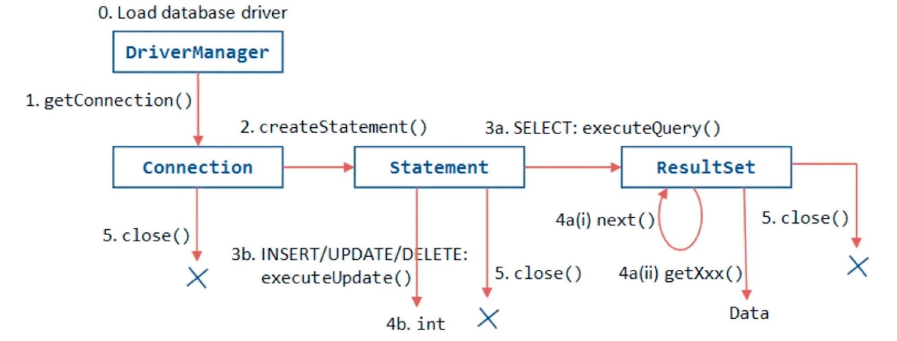


## 🎮 05. 데이터베이스 데이터를 외부에서 다루기 (JDBC)

> ✔️ JDBC를 통해 Java 애플리케이션에서 데이터베이스 데이터를 직접 다루는 방법을 소개합니다. Connection, Statement, ResultSet 객체의 사용법을 배우며, 간단한 CRUD 작업을 실습합니다.


### **1. Spring Boot 의 JDBC 라이브러리**

- **Spring Boot와 JDBC**: Spring Boot는 데이터베이스 연결을 쉽게 구성할 수 있도록 다양한 JDBC 드라이버를 지원합니다. 이를 통해 개발자는 복잡한 설정 없이 데이터베이스와의 연결을 쉽게 구성할 수 있습니다.
- **`spring-boot-starter-jdbc`는** Spring Boot 프로젝트에서 JDBC를 통해 데이터베이스와 상호작용하기 위해 사용되는 스타터 패키지입니다.
    - 이 스타터 패키지는 데이터베이스 작업을 수행하는 데 필요한 주요 의존성과 자동 구성 기능을 제공합니다. 데이터베이스와의 연결을 쉽고 빠르게 구성할 수 있도록 도와주는 브릿지 역할을 합니다.
    - **주요 포함 내용**
        1. **JDBC API 지원**: JDBC API를 통해 SQL 데이터베이스에 접근하고 작업을 수행할 수 있습니다.
        2. **DataSource 구성**: 데이터 소스 연결을 위한 기본적인 설정을 자동으로 구성합니다. 이는 데이터베이스 연결을 관리하는 데 필수적인 요소입니다.
        3. **JdbcTemplate**: **`JdbcTemplate`은** Spring의 핵심 클래스 중 하나로, JDBC 작업의 많은 번거로움을 줄여 줍니다. SQL 쿼리 실행, 결과 세트 처리, 예외 처리 등을 단순화합니다.
    - **주요 장점 내용**
        1. **간소화된 데이터베이스 연결**: **`DataSource`** 설정과 **`JdbcTemplate`** 사용을 통해 복잡한 JDBC 코드를 간소화할 수 있습니다.
        2. **자동 구성**: Spring Boot의 자동 구성 기능은 개발자가 데이터베이스 연결에 필요한 대부분의 구성을 자동으로 처리할 수 있도록 합니다.
        3. **효율적인 예외 처리**: Spring의 **`DataAccessException`을** 통해 JDBC에서 발생하는 예외를 Spring의 일관된 예외 체계로 변환합니다.


### **2. JDBC**

- **JDBC 드라이버란?**: JDBC(Java Database Connectivity)는 자바 애플리케이션에서 데이터베이스에 접근할 수 있도록 하는 API입니다. JDBC 드라이버는 이 API를 구현하여, 자바 애플리케이션과 특정 데이터베이스 간의 연결을 가능하게 합니다.
- **JDBC 드라이버 타입**: JDBC 드라이버는 네 가지 유형(Type 1, 2, 3, 4)이 있으며, 각각의 특징과 사용 환경에 따라 선택할 수 있습니다. Type 4 드라이버(순수 자바 드라이버)가 가장 일반적으로 사용됩니다.
- 문장 그대로 Java 앱과 DB 를 연결시켜주기 위해 만들어진 기술입니다.
- 그렇기 때문에 JPA 도 이 기술을 사용하여 구현되어 있습니다. ✅
- JDBC Driver 는 여러타입의 DB 와 연결할 수 있는 기능을 제공합니다.
- **JDBC 실습**
    - DriverManager 를 통해서 Connection(연결) 을 생성하여 쿼리를 요청할 수 있는 상태를 만들어주고
    - Statement(상태) 를 생성하여 쿼리를 요청하고
    - ResultSet(결과셋) 을 생성해 쿼리 결과를 받아옵니다.
    

    
        
```java
// JdbcApplication.java

package com.thesun4sky.jdbc;

import java.sql.Connection;
import java.sql.DriverManager;
import java.sql.PreparedStatement;
import java.sql.SQLException;

import org.springframework.boot.SpringApplication;
import org.springframework.boot.autoconfigure.SpringBootApplication;

@SpringBootApplication
public class JdbcApplication {

	public static void main(String[] args) throws SQLException {
		// 어플리케이션 실행 컨텍스트 생성
		SpringApplication.run(JdbcApplication.class, args);

		// 데이터베이스 연결정보
		String url = "jdbc:h2:mem:test"; 	// spring.datasource.url
		String username = "sa";				// spring.datasource.username

		// connection 얻어오기
		try (Connection connection = DriverManager.getConnection(url, username, null)) {
			try {
				// 테이블 생성 (statement 생성)
				String creatSql = "CREATE TABLE USERS (id SERIAL, username varchar(255))";
				try (PreparedStatement statement = connection.prepareStatement(creatSql)) {
					statement.execute();
				}

				// 데이터 추가 (statement 생성)
				String insertSql = "INSERT INTO USERS (username) VALUES ('teasun kim')";
				try (PreparedStatement statement = connection.prepareStatement(insertSql)) {
					statement.execute();
				}

				// 데이터 조회 (statement 생성 후 rs = resultSet 수신 & next() 조회)
				String selectSql = "SELECT * FROM USERS";
				try (PreparedStatement statement = connection.prepareStatement(selectSql)) {
					var rs = statement.executeQuery();
					while (rs.next()) {
						System.out.printf("%d, %s", rs.getInt("id"), rs.getString("username"));
					}
				}
			} catch (SQLException e) {
				if (e.getMessage().equals("ERROR: relation \"account\" already exists")) {
					System.out.println("USERS 테이블이 이미 존재합니다.");
				} else {
					throw new RuntimeException();
				}
			}
		}
	}
}

```
        
- PreparedStatement (준비된 상태)
    - Statement 와 다른점
        - Statement는 다음과 같은 동작 방식을 가집니다.
            
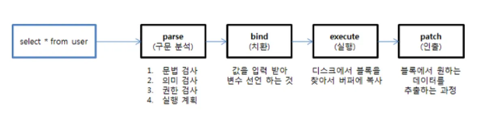


### PreparedStatement

- PreparedStatement는 Statement를 상속하고 있는 Interface입니다.

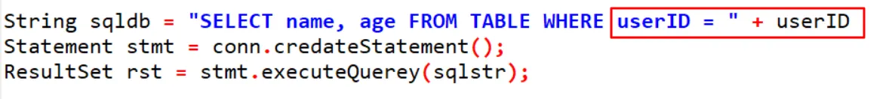

- Statement는  executeQuery() 나 executeUpdate() 를 실행하는 시점에 파라미터로 SQL문을 전달하는데, 이 때 전달되는 SQL 문은 완성된 형태로 한눈에 무슨 SQL 문인지 파악하기 쉽습니다.
- 하지만, Statement 는 SQL문을 수행하는 과정에서 구문 분석을 수행하기 때문에 Prepared Statement에 비해 효율성이 떨어진다.

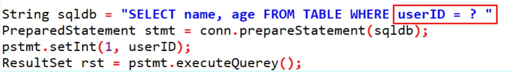

- PreparedStatement는 내부적으로 Statement의 4단계(구문분석, 치환, 실행, 인출) 과정 중 첫 번째 parse 과정의 결과를 캐싱하고, 나머지 3가지 단계만 거쳐서 SQL문이 실행될 수 있게 합니다.
- 즉, PreparedStatement를 사용하면 구문 분석(parse)의 결과를 캐싱해서 과정을 생략할 수 있으므로 성능이 향상됩니다.


💡 **부가적인 장점**

PreparedStatement가 변수 문자열 쿼리를 집어넣어 해킹하는 SQL Injection 도 방어할 수 있습니다.


### 3. JDBC Template (QueryMapper)

- JDBC 로 직접 SQL을 작성했을 때의 문제
    - SQL 쿼리 요청 시 중복 코드 발생
    - DB별 예외에 대한 구분 없이 Checked Exception (SQL Exception) 처리
    - Connection, Statement 등.. 자원 관리를 따로 해줘야함
        - 자원 해제 안해주면 메모리 꽉차서 서버가 죽음

- 이 문제 해결을 위해 처음으로 Persistence Framework 등장!
    - Persistence Framework 는 2가지가 있다.
        - **SQL Mapper** : JDBC Template, MyBatis 👈 요게 먼저나옴
        - **ORM** : JPA, Hibernate
- **SQL Mapper (QueryMapper)**
    - SQL ↔ Object
    - SQL 문과 객체(Object)의 필드를 매핑하여 데이터를 객채화

### JDBC Template (**RowMapper)**

- SQL Mapper 첫번째 주자로 JDBCTemplate 에 **RowMapper** 탄생
    - 쿼리 수행 결과와 객채 필드 매핑
    - **RowMapper** 로 응답필드 매핑코드 재사용
    - Connection, Statement, ResultSet 반복적 처리 대신 해줌
    - 😵‍💫 But, 결과값을 객체 인스턴스에 매핑하는데 여전히 많은 코드가 필요함

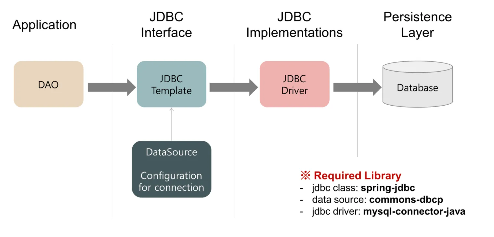

JDBC Template 는 JDBC Driver 를 추상화하여 동작합니다. (dbcp = db connection pool)

### **4. JDBC Template 실습**

1. **insertUser**: 새로운 사용자를 **`users`** 테이블에 추가합니다. 사용자의 이름과 이메일 주소를 매개변수로 받아 데이터베이스에 저장합니다.
2. **findUserNameById**: 주어진 ID에 해당하는 사용자의 이름을 조회합니다. **`queryForObject`** 메서드를 사용하여 단일 결과를 반환합니다.
3. **updateUser**: 주어진 ID의 사용자 이름을 새로운 이름으로 변경합니다. **`UPDATE`** SQL 명령을 사용하여 해당 ID의 사용자 정보를 업데이트합니다.
4. **deleteUser**: 주어진 ID를 가진 사용자를 **`users`** 테이블에서 삭제합니다. **`DELETE`** SQL 명령을 사용하여 해당 ID의 사용자 정보를 삭제합니다.

```java
// DataRepository.java
package com.thesun4sky.jdbc;

import org.springframework.beans.factory.annotation.Autowired;
import org.springframework.jdbc.core.JdbcTemplate;
import org.springframework.stereotype.Repository;

@Repository
public class DataRepository {

	@Autowired
	private JdbcTemplate jdbcTemplate;

	// 테이블 생성
	public void createTable() {
		jdbcTemplate.execute("CREATE TABLE IF NOT EXISTS users (id SERIAL, name VARCHAR(255))");
	}

	// 사용자 추가 (Create)
	public void insertUser(String name) {
		jdbcTemplate.update("INSERT INTO users (name) VALUES (?)", name);
	}

	// 사용자 ID로 이름 조회 (Read)
	public String findUserNameById(Long id) {
		return jdbcTemplate.queryForObject(
			"SELECT name FROM users WHERE id = ?",
			new Object[]{id},
			String.class
		);
	}

	// 사용자 이름 변경 (Update)
	public void updateUser(Long id, String newName) {
		jdbcTemplate.update("UPDATE users SET name = ? WHERE id = ?", newName, id);
	}

	// 사용자 삭제 (Delete)
	public void deleteUser(Long id) {
		jdbcTemplate.update("DELETE FROM users WHERE id = ?", id);
	}
}
```

```java
// JdbcApplication.java
package com.thesun4sky.jdbc;

import org.springframework.boot.SpringApplication;
import org.springframework.boot.autoconfigure.SpringBootApplication;

@SpringBootApplication
public class JdbcApplication {

	public static void main(String[] args) {
		// 어플리케이션 실행 컨텍스트 생성
		var context = SpringApplication.run(JdbcApplication.class, args);
		// 데이터 조회 클래스 빈 조회
		var repository = context.getBean(DataRepository.class);

		// 테이블 생성
		repository.createTable();
		// 유저정보 추가
		repository.insertUser("Teasun Kim");
		// 유저정보 조회
		System.out.println("User Name: " + repository.findUserNameById(1L));
	}
}
```

### **5. JDBC Template** **RowMapper 실습**

- **RowMapper.mapRow** : RowMapper 를 상속받아 mapRow() 메서드를 구현하면 JDBCTemplate 에서 row 응답을 mapRow() 메서드에 rs 파라미터로 넘겨주어 객체에 매핑하기 쉽도록 도와준다.
- **findUserById** : jdbcTemplate.queryForObject() 메서드에서는 두번째 인자로 **RowMapper** 를 넣어줄 경우 해당 **RowMapper** 의 **mapRow()** 메서드를 사용하여 응답을 하도록 동작한다.

```java
// UserRowMapper.java
import java.sql.ResultSet;
import java.sql.SQLException;

import org.springframework.jdbc.core.RowMapper;


public class UserRowMapper implements RowMapper<User> {

	// JDBCTemplate 에서 row 응답을 mapRow() 메서드에 rs 파라미터로 넘겨주어 객체에 매핑하기 쉽도록 도와준다.
  @Override
  public User mapRow(ResultSet rs, int rowNum) throws SQLException {
    var user = new User();
    user.setId(rs.getInt("ID"));
    user.setName(rs.getString("NAME"));
    return user;
  }
}
```

```java
// 사용자 ID로 User 조회 (Read)
public User findUserById(Long id) {
	return jdbcTemplate.queryForObject(
		"SELECT * FROM users WHERE id = ?",
		new UserRowMapper(),  // 이자리에 매퍼를 생성자로 넣어주면 됨
		id
	);
}
```