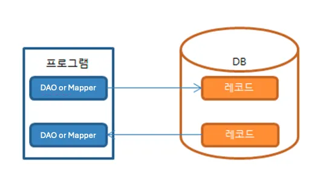
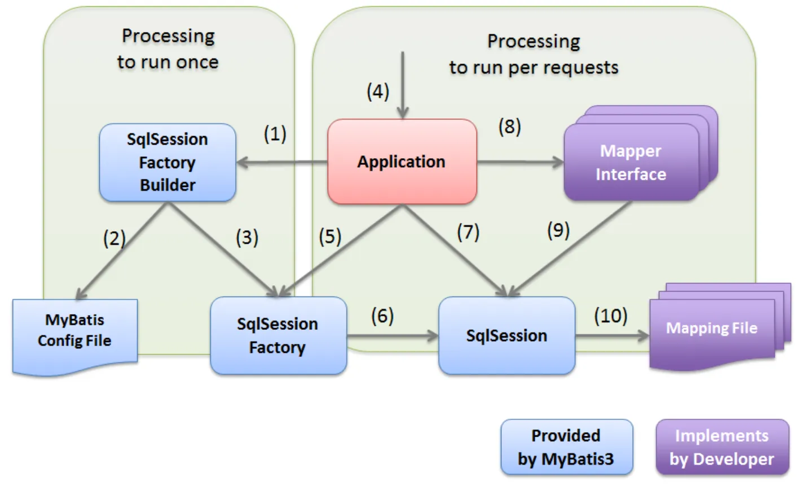
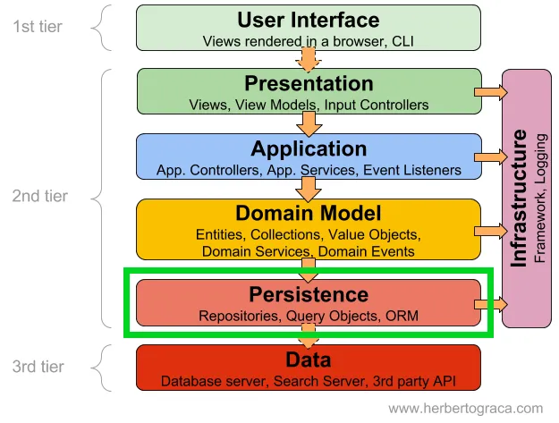
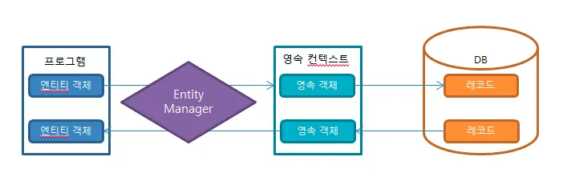
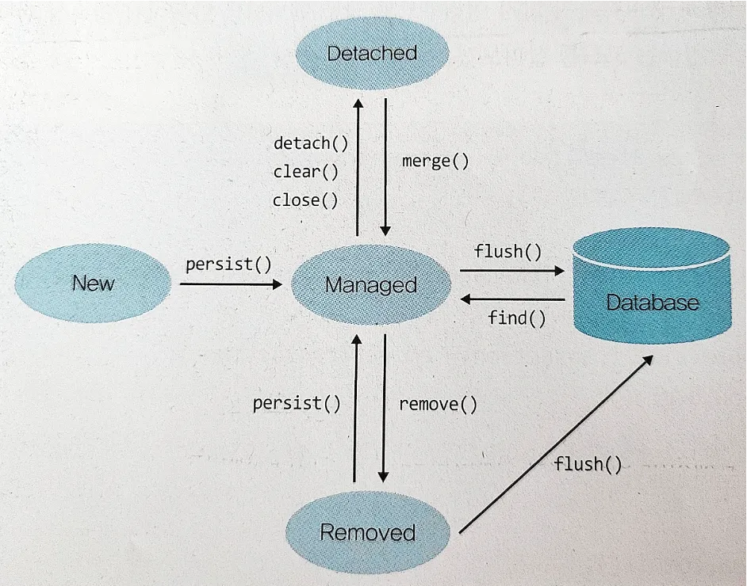
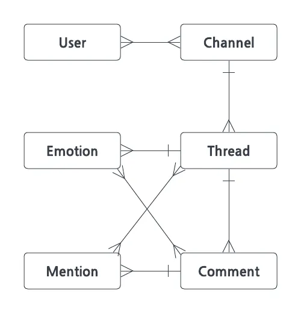

# 3주차 RawJPA 기본 

**[수업 목표]**

- Query Mapper를 사용하여 SQL 쿼리를 관리하는 방법을 배웁니다. 별도의 쿼리 파일을 통해 SQL을 관리함으로써 코드의 가독성과 유지보수성을 높입니다.
- Annotation을 사용하여 SQL 쿼리를 클래스나 메소드에 직접 정의하는 방법을 배웁니다. 이를 통해 동적 쿼리 생성과 실행 과정을 이해하고 실습합니다.
- RawJPA를 사용하여 테이블과 연동되는 객체(엔티티)의 구조와 작동 원리를 배웁니다. JPA의 기본적인 구성 요소와 엔티티의 생명주기를 이해합니다.
- 실제 데이터베이스 테이블과 매핑되는 Java 객체를 생성하는 방법을 배웁니다. 엔티티 클래스 작성과 어노테이션을 통한 필드 매핑 방법을 실습합니다.
- 엔티티 간의 관계(일대일, 일대다, 다대다)를 정의하고 매핑하는 방법을 배웁니다. 연관 관계 매핑을 통해 복잡한 데이터 구조를 효과적으로 관리하는 방법을 학습합니다.


## **⭐ 01. 이번 주에 배울 것**

> ✔️ RawJPA 의 이론을 학습하고 이를 통해서 쿼리를 작성하고 테이블 객체를 만드는 방법을 실습합니다.


## 📁 **02.** 쿼리 파일 만들기 (QueryMapper)

> ✔️ Query Mapper를 사용하여 SQL 쿼리를 관리하는 방법을 배웁니다. 별도의 쿼리 파일을 통해 SQL을 관리함으로써 코드의 가독성과 유지보수성을 높입니다.


### MyBatis 란?

> 📌 MyBatis 는 **RowMapper** 가 가지고있는 단점인 **“반복되는 코드”를** 줄이고 **“함께있는 프로그램 코드와 쿼리 코드를 분리하여 관리”하고** 싶은 니즈를 반영하여 탄생하였습니다.


- SQL Mapper 두번째 주자로 MyBatis 탄생
    - 반복적인 JDBC 프로그래밍을 단순화 하고싶다.
    - SQL 쿼리들을 XML 파일에 작성하여 코드와 SQL 을 분리 하고싶다.
- MyBatis 특징
    - jdbc로 처리하는 코드의 설정(Connection) 부분을 줄이고 실제 sql문에 연결함으로서 빠른 개발이 가능하게 한다. (SQL Mapper 특징)
    - MyBatis 코드는 map 인터페이스(또는 클래스)와 SQL 쿼리와 ResultSet 매핑을 위한 xml 및annotation을 사용한다.
    - 다른 방식에 비해 객체자체보다 쿼리에 집중할 수 있다. 📌

    

SQL Mapper - DB 데이터 연동 구조

- MyBatis 한계점
  - 결국 SQL을 직접 작성하는것은 피곤하다…(DB 기능에 종속적) 😫​
  - 테이블마다 비슷한 CRUD 반복, DB타입 및 테이블에 종속적이다. 😵‍💫​


## MyBatis의 동작



MyBatis 가 Mapping File 을 Access 하는 순서와 동작

- **실행 순서 설명**

> (1) ~ (3)은 응용 프로그램 시작시 수행되는 프로세스입니다.

- (1) 응용 프로그램이 SqlSessionFactoryBuilder를 위해 SqlSessionFactory를 빌드하도록 요청합니다.
- (2) SqlSessionFactoryBuilder는 SqlSessionFactory를 생성하기 위한 Mybatis 구성파일을 읽습니다.
- (3) SqlSessionFactoryBuilder는 Mybatis 구성 파일의 정의에 따라 SqlSessionFactory를 생성합니다.


> (4) ~ (10)은 클라이언트의 각 요청에 대해 수행되는 프로세스입니다.

- (4) 클라이언트가 응용 프로그램에 대한 프로세스를 요청합니다.
- (5) 응용 프로그램은 SqlSessionFactoryBuilder를 사용하여 빌드된 SqlSessionFactory에서 SqlSession을 가져옵니다.
- (6) SqlSessionFactory는 SqlSession을 생성하고 이를 애플리케이션에 반환합니다.
- (7) 응용 프로그램이 SqlSession에서 매퍼 인터페이스의 구현 개체를 가져옵니다.
- (8) 응용 프로그램이 매퍼 인터페이스 메서드를 호출합니다.
- (9) 매퍼 인터페이스의 구현 개체가 SqlSession 메서드를 호출하고 SQL 실행을 요청합니다.
- (10) SqlSession은 매핑 파일에서 실행할 SQL을 가져와 SQL을 실행합니다.
  

SqlSession Factory Builder **(1), (2), (3)**
- MyBatis 설정 파일을 읽어와서
- 설정정보 기반으로 SqlSession Factory 를 생성하는 빌더 객체


**MyBatis Config File (2)**
- 매핑해줄 객체가 들어있는 패키지 경로와
- Mapping File 목록을 지정해주는 설정 파일

```xml
<!-- /resources/mybatis-config.xml -->
<!DOCTYPE configuration
        PUBLIC "-//mybatis.org//DTD Config 3.0//EN"
        "http://mybatis.org/dtd/mybatis-3-config.dtd">
<configuration>
    <typeAliases>
        <package name="com.thesun4sky.querymapper.domain"/>
    </typeAliases>
    <mappers>
        <mapper resource="mapper/UserMapper.xml"/>
    </mappers>
</configuration>
```

SqlSession Factory (3), (5), (6)

- 설정에 맞게 SqlSession 을 생성하여 들고있는 객체

**SqlSession (6), (7), (9), (10)**

- Mapping File 에서 쿼리를 조회해서 쿼리를 수행하고 응답을 받아올 수 있는 세션 객체


**Mapper Interface (8), (9)**

- DB 에서 조회하는 객체와 Java 프로그램의 객체간에 인터페이스를 정의하는 객체
  - **방법1. Dao 클래스 정의**
    - SqlSession 를 직접적으로 사용하는 방법
    - SqlSession 멤버 변수로 사용하며 쿼리파일 수행 요청
```java
// UserDao.java
import org.apache.ibatis.session.SqlSession;
import org.springframework.stereotype.Component;

import com.thesun4sky.querymapper.domain.User;

@Component
public class UserDao {

  // SqlSession 멤버 변수로 사용하며 쿼리파일 수행 요청
  private final SqlSession sqlSession;

  public UserDao(SqlSession sqlSession) {
    this.sqlSession = sqlSession;
  }

  public User selectUserById(long id) {
    return this.sqlSession.selectOne("selectUserById", id);
  }

}
```
- **장점**
    - 쿼리문 실행 전에 넣어줄 매개변수와 쿼리 결과값의 변형을 정의할 수 있다.
    - Namespace를 내 마음대로 둘 수 있다.
    - .xml 파일의 쿼리문 id와 mapper 메소드명을 일치시킬 필요가 없다.
- **단점**
    - Sqlsession 객체를 주입받아야 하며, 쿼리문 실행 시 항상 호출해야 한다.
    - 쿼리문 호출 시 sqlsession에 .xml 파일의 namespce와 쿼리문 id를 매개변수로 넘겨야한다.
- **방법2. Mapper Interface 정의**
    - SqlSession 를 간접적으로 사용하는 방법
    - ibatis 에서 구현해주는  `org.apache.ibatis.annotations.Mapper` 어노테이션을 사용하면 sqlSession 를 사용하여 자동으로 호출해줌

```java
// UserMapper.java
@Mapper
public interface UserMapper {

  User selectUserById(@Param("id") Long id);

}
```

- **장점**
    - 메소드의 내부 구현이 불필요하다.
    - Sqlsession 객체 주입이 불펼요하다.
    - .xml 파일의 쿼리문 id와 mapper 메소드 명이 일치한다.
- **단점**
    - .xml의 Namespace가 실제 Mapper.java 위치를 가르켜야 한다.
    - 메소드 내부 정의가 불가능하다.
- **Mapping File (10)**
    - SqlSession 가 실행하는 쿼리가 담긴 파일
    - 정의된 인터페이스에 기반해서 수행할 쿼리를 담아두고
    - 쿼리 수행결과를 어떤 인터페이스 매핑할지 정의해놓은 파일

```xml
<!-- UserMapper.xml -->
<!DOCTYPE mapper
        PUBLIC "-//mybatis.org//DTD Mapper 3.0//EN"
        "http://mybatis.org/dtd/mybatis-3-mapper.dtd">
<mapper namespace="com.thesun4sky.querymapper.mapper.UserMapper">
    <select id="selectUserById" resultType="User">
        select id, name from users where id = #{id}
    </select>
</mapper>
```


## 📝 03. 쿼리 코드 만들기 (JpaRepository)

> ✔️ Annotation을 사용하여 SQL 쿼리를 클래스나 메소드에 직접 정의하는 방법을 배웁니다. 이를 통해 동적 쿼리 생성과 실행 과정을 이해하고 실습합니다.

### QueryMapper 의 DB 의존성 및 중복 쿼리 문제로 ORM이 탄생했다.

- ORM 은 DB의 주도권을 뺏어왔다고 표현해도 과언이 아닙니다.
- ORM 은 DAO 또는 Mapper 를 통해서 조작하는것이 아니라 테이블을 아예 하나의 객체(Object)와 대응시켜 버립니다.
- 말이 쉽지…. 객체지향(Object) 을 관계형 데이터베이스(Relation) 에 매핑(Mapping) 한다는건 정말 많은 난관이 있습니다.
- 바로 다음 장에서 어떤 난관들이 있고 어떻게 해결했는지 알아볼까요?



### ORM 이 해결해야하는 문제점 과 해결책

### 1. 문제점

**상속의 문제**

- 객체 : 객체간에 멤버변수나 상속관계를 맺을 수 있다.
- RDB : 테이블들은 상속관계가 없고 모두 독립적으로 존재한다.

> 💁‍♂️ 해결방법 : 매핑정보에 상속정보를 넣어준다. (`@OneToMany`, `@ManyToOne`)


**관계 문제**

- 객체 : 참조를 통해 관계를 가지며 방향을 가진다. (다대다 관계도 있음)
- RDB : 외래키(FK)를 설정하여 Join 으로 조회시에만 참조가 가능하다. (즉, 다대다는 매핑 테이블 필요)

> 💁‍♂️ 해결방법 : 매핑정보에 방향정보를 넣어준다. (`@JoinColumn`, `@MappedBy`)

**탐색 문제**

- 객체 : 참조를 통해 다른 객체로 순차적 탐색이 가능하며 콜렉션도 순회한다.
- RDB : 탐색시 참조하는 만큼 추가 쿼리나, Join 이 발생하여 비효율적이다.

> 💁‍♂️ 해결방법 : 매핑/조회 정보로 참조탐색 시점을 관리한다.(`@FetchType`, `fetchJoin()`)

**밀도 문제**

- 객체 : 멤버 객체크기가 매우 클 수 있다.
- RDB : 기본 데이터 타입만 존재한다.

> 💁‍♂️ 해결방법 : 크기가 큰 멤버 객체는 테이블을 분리하여 상속으로 처리한다. (`@embedded`)


**식별성 문제**

- 객체 : 객체의 hashCode 또는 정의한 equals() 메소드를 통해 식별
- RDB : PK 로만 식별

> 💁‍♂️ 해결방법 : PK 를 객체 Id로 설정하고 EntityManager는 해당 값으로 객체를 식별하여 관리 한다.(`@Id`,`@GeneratedValue` )

### 2. 해결책

**영속성 컨텍스트(1차 캐시)를 활용한 쓰기지연**

- **영속성 이란?**
    - 데이터를 생성한 프로그램이 종료되어도 사라지지 않는 데이터의 특성을 말한다.
    - 영속성을 갖지 않으면 데이터는 메모리에서만 존재하게 되고 프로그램이 종료되면 해당 데이터는 모두 사라지게 된다.
    - 그래서 우리는 데이터를 파일이나 DB에 영구 저장함으로써 데이터에 영속성을 부여한다.


SQL Mapper - DB 데이터 연동 구조




ORM - DB 데이터 연동 구조


**영속성 4가지 상태 ( `비영속` > `영속` > `준영속` | `삭제`)**

- **① 비영속(new/transient)** - 엔티티 객체가 만들어져서 아직 저장되지 않은 상태로, 영속성 컨텍스트와 전혀 관계가 없는 상태
- **② 영속(managed)** - 엔티티가 영속성 컨텍스트에 저장되어, 영속성 컨텍스트가 관리할 수 있는 상태
- **③ 준영속(detached)** - 엔티티가 영속성 컨텍스트에 저장되어 있다가 분리된 상태로, 영속성 컨텍스트가 더 이상 관리하지 않는 상태
- **④ 삭제(removed)** - 엔티티를 영속성 컨텍스트와 데이터베이스에서 삭제하겠다고 표시한 상태

- 객체의 영속성 상태는 Entity Manager 의 메소드를 통해 전환된다.


 💁‍♂️ Raw JPA 관점에서 순서대로 요약정리 해보자면,

new > `(비영속상태)` > persist(), merge() > `(영속성 컨텍스트에 저장된 상태)` > flush()  > `(DB에 쿼리가 전송된 상태)` >  commit() > `(DB에 쿼리가 반영된 상태)`




예제 코드

```java
Item item = new Item();		// 1
item.setItemNm("테스트 상품");	

EntityManager em = entityManagerFactory.createEntityManager();	// 2
EntityTransaction transaction = em.getTransaction();		// 3
	
transaction.begin();		
em.persist(item);		// 4-1
em.flush(item).     // 4-2 (DB에 SQL 보내기/commit시 자동수행되어 생략 가능함)
transaction.commit();		// 5

em.close();			// 6

1️⃣  영속성 컨텍스트에 담을 상품 엔티티 생성
2️⃣  엔티티 매니저 팩토리로부터 엔티티 매니저를 생성
3️⃣  데이터 변경 시 무결성을 위해 트랜잭션 시작
4️⃣  영속성 컨텍스트에 저장된 상태, 아직 DB에 INSERT SQL 보내기 전
5️⃣  트랜잭션을 DB에 반영, 이 때 실제로 INSERT SQL 커밋 수행
6️⃣  엔티티 매니저와 엔티티 매니저 팩토리 자원을 close() 호출로 반환
```

- 쓰기 지연이 발생하는 시점

  - flush() 동작이 발생하기 전까지 최적화한다.
  - flush() 동작으로 전송된 쿼리는 더이상 쿼리 최적화는 되지 않고, 이후 commit()으로 반영만 가능하다.

- 쓰기 지연 효과

  - 여러 개의 객체를 생성할 경우 모아서 한번에 쿼리를 전송한다.
  - 영속성 상태의 객체가 생성 및 수정이 여러 번 일어나더라도 해당 트랜잭션 종료시 쿼리는 1번만 전송될 수 있다.
  - 영속성 상태에서 객체가 생성되었다 삭제되었다면 실제 DB에는 아무 동작이 전송되지 않을 수 있다.
  - 즉, 여러가지 동작이 많이 발생하더라도 쿼리는 트랜잭션당 최적화 되어 최소 쿼리만 날라가게 된다.

  > 💁‍♂️ 키 생성전략이 `generationType.IDENTITY` 로 설정 되어있는 경우 생성쿼리는 쓰기지연이 발생하지 못한다.
  >
  > why? 단일 쿼리로 수행함으로써 외부 트랜잭션에 의한 중복키 생성을 방지하여 단일키를 보장한다.

```java
@Getter
@Entity
public class Team {

    @Id @GeneratedValue 
    private Long id;
    
    private String name;

    // Setter methods
}

@Getter
@Entity
public class Member {

    @Id @GeneratedValue 
    private Long id;
    
    private String name;

    @ManyToOne(fetch = FetchType.LAZY)
    @JoinColumn(name = "team_id")
    private Team team;

    // Setter methods
}
```

```java
Team teamA = new Team();
teamA.setName("TeamA");
em.persist(teamA);

Team teamB = new Team();
teamB.setName("TeamB");
em.persist(teamB);

Member member_A = new Member();
member_A.setName("memberA");
member_A.setTeam(teamA);

em.persist(member_A);

// em.flush();

Member findMember = em.find(Member.class, member_A.getId());
Team findTeam= findMember.getTeam();

System.out.println(findTeam.getName());
```

```java
flush가 있는 경우

create member
create team
insert team      // flush로 인해 쓰기지연이 발생하지 않음
insert member    // flush로 인해 쓰기지연이 발생하지 않음
print "TeamA" (memberA.getTeam())
```

```java
flush가 없는 경우

create member
create team
print "TeamA" (memberA.getTeam()) // 쓰기 지연이 발생하더라도 영속성 컨텍스트에서 조회해옴
insert team      // 쓰기 지연이 발생한 부분
insert member    // 쓰기 지연이 발생한 부분
```


## ORM 을 사용하는 가장 쉬운 방법 : JpaRepository


💁‍♂️ **Repository** vs **JpaRepository**

- 기존 Repository
  - **`@Repository` 을** 클래스에 붙인다.
  - **`@Component` 어노테이션을** 포함하고 있어서 앱 실행시 생성 후 Bean으로 등록된다.
  - 앞서배운 Repository 기본 기능만 가진 구현체가 생성된다. (DB별 예외처리 등)
- 새로운 **JpaRepository**
  - **JpaRepository<Entity,ID>** 인터페이스를 인터페이스에 extends 붙인다.
    - `@NoRepositoryBean`된 상위 인터페이스들의 기능을 포함한 구현체가 프로그래밍된다. 
    - (`@NoRepositoryBean`= 빈생성 막음 →상속받으면 생성돼서 사용가능)
      - **JpaRepository (마스터 셰프):** 데이터 액세스를 위한 핵심 기능의 종합적인 요리책(기능) 을 제공합니다.
      - **`@NoRepositoryBean` 인터페이스 (셰프):** 각 인터페이스는 특정 데이터 액세스 방법을 제공하는 전문적인 기술 또는 레시피를 나타냅니다.
      - **JpaRepository 상속:** 마스터 셰프의 요리책과 셰프의 전문성을 얻습니다.
    - SpringDataJpa 에 의해 엔티티의 CRUD, 페이징, 정렬 기능 메소드들을 가진 빈이 등록된다. (상위 인터페이스들의 기능)


**Repository 와 JpaRepository 를 통해 얼마나 간단하게 구현하게 될지 미리 확인해볼까요?**

- Repository 샘플
  - EntityManager 멤버변수를 **직접적으로 사용**

```java
// UserRepository.java
@Repository
public class UserRepository {

  @PersistenceContext
  EntityManager entityManager;

  public User insertUser(User user) {
    entityManager.persist(user);
    return user;
  }

  public User selectUser(Long id) {
    return entityManager.find(User.class, id);
  }
}
```


- JpaRepository 샘플
  - EntityManager 멤버변수를 **간접적으로 사용**

```java
// UserRepository.java
public interface UserRepository extends JpaRepository<User, Long> {
  // 기본 메서드는 자동으로 만들어짐
}
```


## 📋 04. 테이블 객체 이해하기

> ✔️ JpaRepository 를 구현하기 위해서 필요한, 테이블과 연동되는 객체(엔티티)의 구조와 작동 원리를 배웁니다. 
> JPA의 기본적인 구성 요소와 엔티티의 생명주기를 이해합니다.


### 도메인 모델과 테이블 설계

- 슬랙 도메인



- **User : 유저 정보로 채널과 관계만 양방향이고, 다른 도메인과는 단방향 관계를 가집니다.**
- **Channel : 대화 채널은 유저와 다대다 관계를 가진다.**
- **Thread : 채널내 대화 쓰레드로 Post 와 같이 댓글, 이모지, 멘션과 관계를 가진다.**
- Comment : 쓰레드내 댓글로 쓰레드와 다대일 관계를 가지며 이모지, 멘션과도 관계를 가진다.
- Emotion : 쓰레드, 댓글내 이모지로 쓰레드, 댓글과 다대다 관계를 가집니다.
- Mention : 쓰레드, 댓글내 멘션으로 쓰레드, 댓글과 다대다 관계를 가집니다.


### Raw JPA 테이블 매핑 기능

**`@Entity`**

- 객체 관점에서의 이름
- 디폴트로 클래스명으로 설정됨
- 엔티티의 이름은 JQL에서 쓰임
  - JQL : Entity 명으로 쿼리짤때 쓰이는 언어 (ex. JPQL, QueryDsl)

**`@Table`**

- RDB 의 테이블 이름

- @Entity의 이름이 테이블의 기본값

  - 주로 Entity 이름과 다르게 Table 명을 지정하고 싶을때 아래와 같이 사용

    ```java
    @Entity
    @Table(name = "users")
    public class User () {...}
    ```

- 테이블의 이름은 SQL에서 쓰임

  - SQL : Table 명으로 쿼리짤때 쓰이는 언어 (ex. JDBC, SQL Mapper)

**`@Id`**

- 엔티티의 주키를 맵핑할 때 사용
- 자바의 모든 primitive 타입과 그 랩퍼 타입을 사용할 수 있음
  - Date랑 BigDecimal, BigInteger도 사용 가능
- 복합키를 만드는 맵핑하는 방법도 있지만 그건 논외로..

**`@GeneratedValue`**

- 주키의 생성 방법을 맵핑하는 애노테이션
- 생성 전략과 생성기를 설정할 수 있다
  - 기본 전략은 AUTO: 사용하는 DB에 따라 적절한 전략 선택
  - `TABLE`, `SEQUENCE`, `IDENTITY` 중 하나

**`@Column`**

- unique
- nullable
- length
- columnDefinition
- ...

**`@Temporal`**

- 현재 JPA 2.1까지는 Date와 Calendar만 지원

**`@Transient`**

- 컬럼으로 맵핑하고 싶지 않은 멤버 변수에 사용

```java
@Entity(name = "parent")
public class Parent {
    @Id
    @GeneratedValue(strategy = GenerationType.IDENTITY)
    private Long id;
    
    @ManyToMany
    @JoinTable(
        name = "parent_child",
        joinColumns = @JoinColumn(name = "parent_id"),
        inverseJoinColumns = @JoinColumn(name = "child_id")
    )
    private List<Child> childList;
}
```


### Raw JPA 필드 타입 매핑 기능

**Value 타입 종류**

- 기본 타입
  - `@Column`
    - String, Date, Boolean, 과 같은 타입들에 공통으로 사이즈 제한, 필드명 지정과 같이 옵션을 설정할 용도로 쓰인다.
    - Class 에 `@Entity` 가 붙어있으면 자동으로 필드들에 `@Column` 이 붙음
  - `@Enumerated`
    - Enum 매핑용도로 쓰이며 **실무에서는 `@Enumerated(EnumType.STRING)` 으로 사용권장**
    - **Default 타입인 `ORDINAL` 은 0,1,2.. 값**으로 들어가기 때문에 추후 순서가 바뀔 가능성있다.
- Composite Value 타입
  - **`@Embeddable`** : 복합 값 객체로 사용할 클래스 지정
  - **`@Embedded`** : 복합 값 객체 적용할 필드 지정

```java
@Embeddable
public class Address {
    private String city;
    private String street;
}
```

- **`@AttributeOverrides`** : 복합 값 객체 여러개 지정
- **`@AttributeOverride`** : 복합 값 객체 필드명 선언

```java
@NoArgsConstructor(access = AccessLevel.PROTECTED)
@Entity
@Setter
@Getter
public class Member{

    @Id @GeneratedValue
    @Column(name = "MEMBER_ID")
    private Long id;


    private String name;

    @Embedded
    @AttributeOverrides({
            @AttributeOverride(name = "city", column = @Column(name = "home_city")),
            @AttributeOverride(name = "street", column = @Column(name = "home_street")),
    })
    private Address homeAddress;


    @Embedded
    @AttributeOverrides({
            @AttributeOverride(name = "city", column = @Column(name = "company_city")),
            @AttributeOverride(name = "street", column = @Column(name = "company_street")),
    })
    private Address companyAddress;


}
```

위 Entity 로 인해 생성되는 테이블

```sql
CREATE TABLE MEMBER (
  MEMBER_ID BIGINT NOT NULL AUTO_INCREMENT,
  NAME VARCHAR(255) NOT NULL,
  home_city VARCHAR(255) NOT NULL,      # Embedded address.city
  home_street VARCHAR(255) NOT NULL,    # Embedded address.street
  company_city VARCHAR(255) NOT NULL,   # Embedded address.city
  company_street VARCHAR(255) NOT NULL, # Embedded address.street
  PRIMARY KEY (MEMBER_ID)
);
```

- Collection Value 타입

  > 💡 컬럼의 값 크기제한이 있기 때문에 현업에서는 Collection Value 를 사용하지 않고, 일대다 연관관계를 통한 Collection 타입의 변수를 주로 사용합니다.

  - 기본 타입의 콜렉션
    - 기본 타입의 컬렉션은 일반적인 Java 컬렉션 클래스(예: `List`, `Set`, `Map`)를 사용하여 구현할 수 있습니다. JPA는 이러한 컬렉션을 엔티티의 필드로 선언하고, `@ElementCollection` 어노테이션을 사용하여 매핑하면 됩니다.
  - Composite 타입의 콜렉션
    - Composite 타입도 동일하게 `@ElementCollection` 어노테이션을 사용하여 콜렉션 매핑이 가능합니다.


## 👷 05. 테이블 객체 만들기

>  ✔️ 실제 데이터베이스 테이블과 매핑되는 Java 객체를 생성하는 방법을 배웁니다. 엔티티 클래스 작성과 어노테이션을 통한 필드 매핑 방법을 실습합니다.


### Entity 코드 정리

- IntelliJ Live Template 사용 추천
  - Settings > Editor > Live Templates
  - Template text:

```java
/**
 * 컬럼 - 연관관계 컬럼을 제외한 컬럼을 정의합니다.
 */
 

/**
 * 생성자 - 약속된 형태로만 생성가능하도록 합니다.
 */
 

/**
 * 연관관계 - Foreign Key 값을 따로 컬럼으로 정의하지 않고 연관 관계로 정의합니다.
 */
 
 
/**
 * 연관관계 편의 메소드 - 반대쪽에는 연관관계 편의 메소드가 없도록 주의합니다.
 */
 

/**
 * 서비스 메소드 - 외부에서 엔티티를 수정할 메소드를 정의합니다. (단일 책임을 가지도록 주의합니다.)
 */
```


### User Entity 만들어보기

id, username, password 를 가지는 User Entity 를 만들어 봅니다.

```java
// User.java
// lombok
@Getter
@NoArgsConstructor(access = AccessLevel.PROTECTED)
@ToString

// jpa
@Entity
@Table(name = "users")
public class User {

  /**
   * 컬럼 - 연관관계 컬럼을 제외한 컬럼을 정의합니다.
   */
  @Id
  @GeneratedValue(strategy = GenerationType.IDENTITY)
  @Column(name = "id")
  private Long id;

  private String username;

  private String password;

  /**
   * 생성자 - 약속된 형태로만 생성가능하도록 합니다.
   */
  @Builder
  public User(String username, String password) {
    this.username = username;
    this.password = password;
  }

  /**
   * 연관관계 - Foreign Key 값을 따로 컬럼으로 정의하지 않고 연관 관계로 정의합니다.
   */
  @OneToMany
  @Exclude
  private Set<UserChannel> userChannel;

  /**
   * 연관관계 편의 메소드 - 반대쪽에는 연관관계 편의 메소드가 없도록 주의합니다.
   */

  /**
   * 서비스 메소드 - 외부에서 엔티티를 수정할 메소드를 정의합니다. (단일 책임을 가지도록 주의합니다.)
   */
  public void updateUserName(String username) {
    this.username = username;
  }

  public void updatePassword(String password) {
    this.password = password;
  }
}
```


## 💑 06. 테이블 객체끼리 관계만들기

> ✔️ 엔티티 간의 관계(일대일, 일대다, 다대다)를 정의하고 매핑하는 방법을 배웁니다. 연관 관계 매핑을 통해 복잡한 데이터 구조를 효과적으로 관리하는 방법을 학습합니다.


### Raw JPA 연관관계 매핑 기능

- **도메인 연관관계 다시보기** 👀

  - 슬랙 도메인

  

  

  - **User : 유저 정보로 채널과 관계만 양방향이고, 다른 도메인과는 단방향 관계를 가집니다.**
  - **Channel : 대화 채널은 유저와 다대다 관계를 가진다.**
  - **Thread : 채널내 대화 쓰레드로 Post 와 같이 댓글, 이모지, 멘션과 관계를 가진다.**
  - **Comment : 쓰레드내 댓글로 쓰레드와 다대일 관계를 가지며 이모지, 멘션과도 관계를 가진다.**
  - Emotion : 쓰레드, 댓글내 이모지로 쓰레드, 댓글과 다대다 관계를 가집니다.
  - Mention : 쓰레드, 댓글내 멘션으로 쓰레드, 댓글과 다대다 관계를 가집니다.

**`@OneToOne`**

- 일대일 관계를 나타내는 매핑 정보

- 1:1 관계를 지정하기에 앞서 이것이 꼭 물리적으로 테이블이 분리되어야 하는지에 대해 생각해 봐야 합니다.

- 1:1 관계로 구성 한다는 것은 결국 하나의 목적에 부합되는 공통된 데이타를 관리한다고 볼 수 있으며 이것은 하나의 테이블에서 관리 할 수 있는 데이타일 가능성이 높다는 의미입니다.

- 즉, 의도적 중복이 아니라면 사용할 일이 없다는 말

  - 의도적 중복 예시) 버블 구독상품을 사서 채팅방이 생길경우. 구독상품과 채팅방은 1:1 관계

  ```java
  // 일대일 단방향
  @Entity
  public class Member {
    @Id @GeneratedValue
    @Column(name = "MEMBER_ID")
    private Long id;
  
    private String username;
  
    @OneToOne
    @JoinColumn(name = "LOCKER_ID")
    private Locker locker;
  }
  
  @Entity
  public class Locker {
    @Id @GeneratedValue
    @Column(name = "LOCKER_ID")
    private Long id;
  
    private String name;
  }
  ```

  ```java
  // 일대일 양방향
  @Entity
  public class Member {
    @Id @GeneratedValue
    @Column(name = "MEMBER_ID")
    private Long id;
  
    private String username;
  
    @OneToOne
    @JoinColumn(name = "LOCKER_ID")
    private Locker locker;
  }
  
  @Entity
  public class Locker {
    @Id @GeneratedValue
    @Column(name = "LOCKER_ID")
    private Long id;
  
    private String name;
  
    @OneToOne(mappedBy = "locker")
    private Member member;
  ```


`@OneToMany`

- 일대다 관계를 나타내는 매핑 정보
- `@OneToMany`가 [단방향으로 쓰이면 문제가 발생할 수 있다.](https://www.notion.so/0085a4d21ae84dc48e8eda40b621e5a0?pvs=21)
- 속도를 위해 기본적으로 **FetchType** 설정이 **LAZY** 로 설정되어 있습니다.
- 속성
  - mappedBy : 연관관계의 주인 필드를 선택한다.
  - fetch : 글로벌 페치 전략 설정
  - cascade : 영속성 전이 기능을 사용한다.
  - targetEntity : 연관된 엔티티의 타입 정보를 설정한다.

```java
// 일대다 단방향 관계
@Entity(name = "parent")
public class Parent {
    @Id
    @GeneratedValue(strategy = GenerationType.IDENTITY)
    private Long id;
    
    @OneToMany
	@JoinColumn(name = "parent_id")
    private List<Child> childList;
}

@Entity(name = "child")
public class Child {
    @Id
    @GeneratedValue(strategy = GenerationType.IDENTITY)
    private Long id;

	@Column(name = "parent_id")
	private Long parentId;
}
```

```java
// 일대다 양방향 관계는 없음!

// 대신, 다대일 양방향 관계
@Entity(name = "parent")
public class Parent {
    @Id
    @GeneratedValue(strategy = GenerationType.IDENTITY)
    private Long id;
    
    @OneToMany(mappedBy="parent")
    private List<Child> childList;
}

@Entity(name = "child")
public class Child {
    @Id
    @GeneratedValue(strategy = GenerationType.IDENTITY)
    private Long id;

	@ManyToOne
	@JoinColumn(name = "parent_id")
	private Parent parent;
}
```

**`@ManyToOne`**

- 다대일 관계를 나타내는 매핑 정보
- 속성
  - optional (default true) : false로 설정하면 연관된 엔티티가 반드시 있어야 함.
  - fetch : 글로벌 패치 전략 설정
    - ✋ 기본이 EGEAR 로 설정되어있으나 실무에서는 기본 LAZY로 설정하는것 추천!
  - cascade : 영속성 전이 기능 사용
  - targetEntity : 연관된 엔티티의 타입 정보 설정 (targetEntity = Member.class 식으로 사용)

**`@JoinColumn`**

- 외래 키 매핑 시 사용 (Join 을 요청하기 위한 매핑정보로 쓰인다.)
- `@ManyToOne` 어노테이션과 주로 함께 쓰인다. (조인대상 컬럼 지정기능을 안쓸거면 생략해도 됨)
- name 속성은 매핑할 외래키의 이름
- 어노테이션을 생략해도 외래 키가 생성됨.
  - 생략 시 외래키의 이름이 기본 전략을 활용하여 생성된다.
- 속성
  - name : 매핑할 외래 키의 이름
  - referencedColumnName : 외래 키가 참조하는 대상 테이블의 컬럼명
  - foreignKey : 외래 키 제약조건 지정 (테이블 생성 시에만 적용됨)
  - unique/nullable/insertable/updateable/columnDefinition/table : `@Column`의 속성과 같음

```java
@Entity(name = "parent")
public class Parent {
    @Id
    @GeneratedValue(strategy = GenerationType.IDENTITY)
    private Long id;
}

@Entity(name = "child")
public class Child {
    @Id
    @GeneratedValue(strategy = GenerationType.IDENTITY)
    private Long id;
    
    @ManyToOne
    @JoinColumn(name = "parent_id")
    private Parent parent;
}
```

**`@ManyToMany`**

- 다대다 관계를 나타내는 매핑 정보 (N:M)

- 다대다 설정을 하게되면 중간 매핑테이블(JoinTable)이 자동으로 생성된다.

- 중간 매핑 테이블은 JPA상에서 숨겨져서(Entity 정의 없이) 관리된다.

  ```java
  @Entity
  public class Parent {
      @Id
      @GeneratedValue(strategy = GenerationType.IDENTITY)
      private Long id;
      
      @ManyToMany(mappedBy = "parents")
      private List<Child> childs;
  }
  
  @Entity
  public class Child {
      @Id
      @GeneratedValue(strategy = GenerationType.IDENTITY)
      private Long id;
      
      @ManyToMany
      @JoinTable(
          name = "parent_child",
          joinColumns = @JoinColumn(name = "parent_id"),
          inverseJoinColumns = @JoinColumn(name = "child_id")
      )
      private List<Parent> parents;
  }
  ```

- ✋ 매핑 테이블 관리가 불가능하여서 실무에서는 잘 사용하지 않는 기능 입니다.

  - 실무에서는 매핑 테이블을 아래와 같은 형태로 직접 정의합니다.

> TableA(`@OneToMany`) > MappingTable(`@ManyToOne`, `@ManyToOne`) > TableB(`@OneToMany`)

```java
@Entity
public class Parent {
    @Id
    @GeneratedValue(strategy = GenerationType.IDENTITY)
    private Long id;
    
    @OneToMany(mappedBy = "parent")
    private List<ParentChild> parentChilds;
}

@Entity
public class ParentChild {
    @Id
    @GeneratedValue(strategy = GenerationType.IDENTITY)
    private Long id;
    
    @ManyToOne
		@JoinColumn("parent_id")
    private Parent parent;

    @ManyToOne
		@JoinColumn("child_id")
    private Child child;
}

@Entity
public class Child {
    @Id
    @GeneratedValue(strategy = GenerationType.IDENTITY)
    private Long id;
    
    @OneToMany(mappedBy = "child")
    private List<ParentChild> parentChilds;
}
```