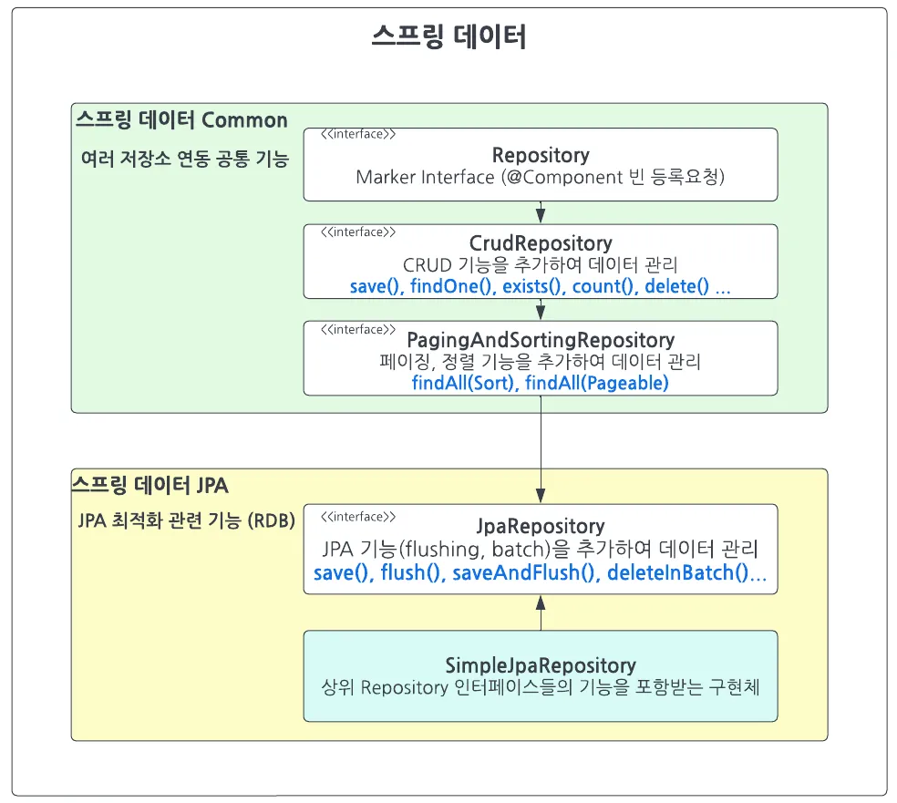
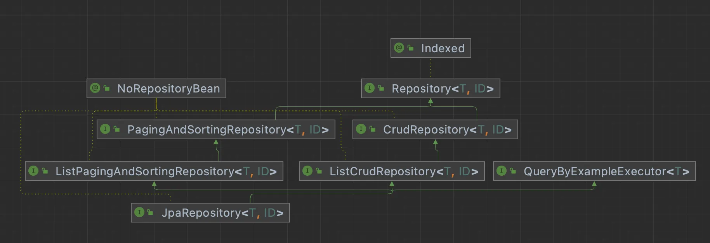

# 4주차 SpringData JPA 기본 🍎


**[수업 목표]**

- Spring Data JPA를 사용하여 엔티티 객체를 효율적으로 관리하는 방법을 배웁니다. 리포지터리 인터페이스의 역할과 기본적인 메소드 사용법을 설명합니다.
- JpaRepository 인터페이스를 활용하여 CRUD 작업을 자동으로 처리하는 방법을 배웁니다. 메소드 이름만으로 쿼리를 생성하는 방법과 그 장점을 학습합니다.
- 페이지네이션을 사용하여 대량의 데이터를 효율적으로 조회하는 방법을 배웁니다. Spring Data JPA에서 제공하는 Pageable 인터페이스를 사용하는 실습을 통해 데이터 처리 성능을 최적화하는 방법을 학습합니다.
- JPQL을 사용하여 복잡한 쿼리를 수동으로 작성하고 실행하는 방법을 배웁니다. 커스텀 쿼리를 통해 표준 SQL에서 지원하지 않는 기능을 구현하는 방법을 배웁니다.


## ✋ 02. 테이블 객체 다루는법

### Cascade (영속성 전이)

- 사용 위치
  - 연관관계의 주인 반대편 - 부모 엔티티(**다대일**에서 **일**)
  - 즉, `@OneToMany` 가 있는 쪽 또는 `@OneToOne` 도 가능
  - 예를 들어, 게시글과 첨부파일이라면 **일**에 해당하는 게시글에 설정한다.
- 사용 조건
  - 양쪽 엔티티의 라이프사이클이 동일하거나 비슷해야한다.
    - 예를 들어, 게시글이 삭제되면 첨부파일도 같이 삭제 되어야 한다.
  - 대상 엔티티로의 영속성 전이는 현재 엔티티에서만 전이 되어야 한다. (다른곳에서 또 걸면 안됨)
    - 예를 들어, 첨부파일을 게시글이 아닌 다른곳에서 영속성 전이를 하면 안된다.
- 옵션 종류
  - **ALL** : 전체 상태 전이
  - **PERSIST** : 저장 상태 전이
  - **REMOVE** : 삭제 상태 전이
  - **MERGE** : 업데이트 상태 전이
  - **REFERESH** : 갱신 상태 전이
  - **DETACH** : 비영속성 상태 전이

```java

/**
 * Defines the set of cascadable operations that are propagated
 * to the associated entity.
 * The value<code>cascade=ALL</code>is equivalent to
 *<code>cascade={PERSIST, MERGE, REMOVE, REFRESH, DETACH}</code>.
 *
 *@since1.0
 */
public enum CascadeType {

/** Cascade all operations */
ALL,

/** Cascade persist operation */
PERSIST,

/** Cascade merge operation */
MERGE,

/** Cascade remove operation */
REMOVE,

/** Cascade refresh operation */
REFRESH,

/**
     * Cascade detach operation
     *
     *@since2.0
     *
     */
DETACH
}
```


### **orphanRemoval (고아 객체 제거)**

- 사용 위치

  - `@OneToMany` 또는 `@OneToOne` 에서 사용 - 부모 엔티티

- 사용법

  - **Cascade.REMOVE** 와 비슷한 용도로 삭제를 전파하는데 쓰인다.
  - 부모 객체에서 리스트 요소삭제를 했을 경우, 해당 자식 객체는 매핑정보가 없어지므로 대신 삭제해준다.
    - 요건 DB 에서는 절대 알 수 없는 행동이다. (부모가 자식의 손을 놓고 버리고 간 고아 객체)

  ```java
  Parent parent1 = em.find(Parent.class, parent.getId());
  parent1.getChildList().remove(0); // delete 쿼리나간다.
  ```

  >  💁‍♂️ 그렇다면 **Cascade.REMOVE** 와 **orphanRemoval 차이점은 무엇인가?**
  >
  > Cascade.REMOVE의 경우 **일**에 해당하는 부모 엔티티를 em.remove를 통해 직접 삭제할 때, 그 아래에 있는 **다**에 해당하는 자식 엔티티들이 삭제되는 것입니다.

  **orphanRemoval=true**는 위 케이스도 포함하며, **일**에 해당하는 부모 엔티티의 리스트에서 요소를 삭제하기만 해도 해당 **다**에 해당하는 자식 엔티티가 delete되는 기능까지 포함하고 있다고 이해하시면 됩니다. 즉, **orphanRemoval=true 는 리스트 요소로써의 영속성 전이도 해준다는 뜻**

- 옵션

  - true
  - false

>  ✅ **영속성 전이 최강 조합 : orphanRemoval=true + Cascade.ALL**
>
> 위 2개를 함께 설정하면 **자식 엔티티의 라이프 사이클이 부모 엔티티와 동일해지며, 직접 자식 엔티티의 생명주기를 관리할 수 있게 되므로 자식 엔티티의 Repository 조차 없어도 된다.** (따라서, 매핑 테이블에서 많이 쓰임)


### Fetch (조회시점)

- 사용 위치
  - Entity 에 FetchType 으로 설정할 수 있다.
    - `@ElementCollection`, `@ManyToMany`, `@OneToMany`, `@ManyToOne`, `@OneToOne`
  - Query 수행시 fetch Join 을 통해서 LAZY 인 경우도 즉시 불러올 수 있다.
- 사용법
  - 기본 LAZY를 설정한 뒤에 필요할 때만 fetch Join을 수행한다.
  - 항상 같이 쓰이는 연관관계 일 경우만 EAGER 를 설정한다.
- 옵션(FetchType)
  - EAGER : 즉시 로딩 (부모 조회 시 자식도 같이 조회)
  - LAZY : 지연 로딩 (자식은 필요할때 따로 조회)

```java
/**
 * Defines strategies for fetching data from the database.
 * The<code>EAGER</code>strategy is a requirement on the persistence
 * provider runtime that data must be eagerly fetched. The
 *<code>LAZY</code>strategy is a hint to the persistence provider
 * runtime that data should be fetched lazily when it is
 * first accessed. The implementation is permitted to eagerly
 * fetch data for which the<code>LAZY</code>strategy hint has been
 * specified.
 *
 *<pre>
*   Example:
 *&#064;Basic(fetch=LAZY)
 *   protected String getName() { return name; }
 *</pre>
*
*@see Basic
*@see ElementCollection
*@see ManyToMany
*@see OneToMany
*@see ManyToOne
*@see OneToOne
*@since1.0
 */
public enum FetchType {

/** Defines that data can be lazily fetched. */
LAZY,

/** Defines that data must be eagerly fetched. */
EAGER
}
```


## 🤖 03. 테이블 객체로 자동 쿼리 생성하기

> ✔️ JpaRepository 인터페이스를 활용하여 CRUD 작업을 자동으로 처리하는 방법을 배웁니다. 
> 메소드 이름만으로 쿼리를 생성하는 방법과 그 장점을 학습합니다.


### JpaRepository 쿼리 기능

- SprintData Common 의 `CRUDRepository` + `PagingAndSortingRepository` 이 쿼리기능을 제공



- Repository 는 MarkerInterface 로 특별한 기능은 없음
- Repository ~ JpaRepository 까지는 `@NotRepositoryBean` 이 붙어있는 인터페이스이다.
- JpaRepository<Entity,ID> 붙이면 알맞은 프로그래밍 된 `SimpleJpaReository` 구현체 빈이 등록된다.

어떻게? **`@SpringBootApplication`** 을 통해 자동으로 붙여지는 **`@EnableJpaRepositories`** 의 **JpaRepositoriesRegistrar** 를 통해서 등록된다.

- **JpaRepositoriesRegistrar 는 ImportBeanDefinitionRegistrar** 의 구현체이다.
- **ImportBeanDefinitionRegistrar** 는 프로그래밍을 통해 빈을 주입해준다.

- 직접해보는 프로그래밍을 통한 레파지토리 주입 실습코드 스니펫

  ```java
  // MyRepository.java
  
  @Setter
  public class MyRepository {
  
    private HashMap<Long, String> dataTable; // DB 테이블을 의미
  
    public String find(Long id) {
      return dataTable.getOrDefault(id, "");
    }
  
    public Long save(String data) {
      var newId = Long.valueOf(dataTable.size());
      this.dataTable.put(newId, data);
      return newId;
    }
  }
  ```

  ```java
  // MyRepositoryRegistrar.java
  
  public class MyRepositoryRegistrar implements ImportBeanDefinitionRegistrar {
  
    @Override
    public void registerBeanDefinitions(AnnotationMetadata importingClassMetadata,
        BeanDefinitionRegistry registry) {
  
      // 주입할 빈에 대해 프로그래밍 하는 부분!!
      GenericBeanDefinition beanDefinition = new GenericBeanDefinition();
      beanDefinition.setBeanClass(MyRepository.class);
      beanDefinition.getPropertyValues().add("dataTable", Map.of(1L, "data"));
      // 여기까지!
  
      registry.registerBeanDefinition("myRepository", beanDefinition);
    }
  }
  ```

  ```java
  // TestApplication.java
  
  @Import(MyRepositoryRegistrar.class) // 빈 주입!
  @SpringBootTest
  public class MyRepositoryTest {
  
    @Autowired
    MyRepository myRepository;
  
    @Test
    void myRepositoryTest() {
      // given
      var newData = "NEW DATA";
      var savedId = myRepository.save(newData);
  
      // when
      var newDataList = myRepository.find(savedId);
  
      // then
      System.out.println(newDataList);
    }
  }
  ```


 💁‍♂️ **기존 Repository** vs 새로운 **JpaRepository**

- 기존 Repository
  - **`@Repository`** 을 클래스에 붙인다.
  - 앞서 배운 RawJPA의 Repository 기능만 가진 구현체가 생성된다. (DB별 예외처리 등)
- 새로운 JpaRepository
  - JpaRepository<Entity,ID> 인터페이스를 인터페이스에 extends 붙인다.
    - **`@NotRepositoryBean`** 된 상위 인터페이스들의 기능을 포함한 구현체가 프로그래밍된다. (**`@NotRepositoryBean`** = 빈생성 막음)
    - SpringDataJpa 에 의해 엔티티의 CRUD, 페이징, 정렬 기능 메소드들을 가진 빈이 등록된다. (상위 인터페이스들의 기능) 


Repository를 JpaRepository 로 간단하게 바꾸기!

```java
// 변경 전
@Repository
public class UserRepository {

  @PersistenceContext
  EntityManager entityManager;

  public User insertUser(User user) {
    entityManager.persist(user);
    return user;
  }

  public User selectUser(Long id) {
    return entityManager.find(User.class, id);
  }
}

// 변경 후
public interface UserRepository extends JpaRepository<User, Long> {
  
}
```


### JpaRepository 쿼리 사용 방법

프로그래밍되어 제공되는 쿼리명 규칙

```
리턴타입 {접두어}{도입부}By{프로퍼티 표현식}(조건식)[(And|Or){프로퍼티 표현식}(조건식)](OrderBy{프로퍼티}Asc|Desc) (매개변수...)
```

| 접두어          | Find, Get, Query, Count, ...                                 |
| --------------- | ------------------------------------------------------------ |
| 도입부          | `Distinct, First(N), Top(N)`                                 |
| 프로퍼티 표현식 | `Person.Address.ZipCode => find(Person)ByAddress_ZipCode(...)` |
| 조건식          | `IgnoreCase, Between, LessThan, GreaterThan, Like, Contains, ...` |
| 정렬 조건       | `OrderBy{프로퍼티}Asc`                                       |
| 리턴 타입       | `E, Optional<E>, List<E>, Page<E>, Slice<E>, Stream<E>`      |
| 매개변수        | `Pageable, Sort`                                             |

 **쿼리 실습 코드**

```java
// 기본
List<User> findByNameAndPassword(String name, String password);

// distinct (중복제거)
List<User> findDistinctUserByNameOrPassword(String name, String password);
List<User> findUserDistinctByNameOrPassword(String name, String password);

// ignoring case (대소문자 무시)
List<User> findByNameIgnoreCase(String name);
List<User> findByNameAndPasswordAllIgnoreCase(String name, String password);

// 정렬
List<Person> findByNameOrderByNameAsc(String name);
List<Person> findByNameOrderByNameDesc(String name);

// 페이징
Page<User> findByName(String name, Pageable pageable);  // Page 는 카운트쿼리 수행됨
Slice<User> findByName(String name, Pageable pageable); // Slice 는 카운트쿼리 수행안됨
List<User> findByName(String name, Sort sort);
List<User> findByName(String name, Pageable pageable);

// 스트림 (stream 다쓴후 자원 해제 해줘야하므로 try with resource 사용추천)
Stream<User> readAllByNameNotNull();
```

💡 **Pageable vs Sorting**

- Pageable
  - Pageable 인터페이스를 구현한 PageRequest 객체를 만들거나 얻습니다.
  - PageRequest 객체를 repository 메소드에 우리가 의도한대로 인자로 전달합니다.
  - PageRequest 객체는 요청된 페이지 숫자와 페이지 사이즈를 넘김으로서 만듭니다. (페이지 숫자는 0부터 시작합니다)

```java
// 첫 페이지 (페이지 사이즈 = 2)
Pageable firstPageWithTwoElements = PageRequest.of(0, 2);
// 두번째 페이지 (페이지 사이즈 = 5)
Pageable secondPageWithFiveElements = PageRequest.of(1, 5);
```

```java
// 페이지 사용
List<Product> allTenDollarProducts =
  productRepository.findAllByPrice(10, secondPageWithFiveElements);
```

- `findAll(Pageable pageable)` 메소드는 기본적으로 Page 객체를 리턴합니다.
- 그러나, 우리는 또한 커스텀 메소드를 통해 페이지네이션된 데이터를 Page , Slice 또는 List 의 타입으로 받을 수 있습니다.
- Page 인스턴스는 Product 의 목록 뿐 아니라 페이징할 수 있는 전체 목록의 숫자도 알고 있습니다.
  - 이를 실행하기 위해 추가적으로 쿼리 작업이 들어갑니다.
- 이러한 작업에 대한 비용을 방지하기 위해, 우리는 대신 Slice나 List로 반환 받을 수 있습니다.
  - Slice 는 단지 다음 slice가 가능한지 아닌지만 알고 있습니다.

- Sorting
  - 유사하게, 우리의 쿼리 결과를 정렬하기 위해선 Sort 객체를 메소드에 전달하면 됩니다.
  - 만약, 정렬과 페이지네이션을 둘다 하고 싶다면 어떻게 해야할까요?
    - 정렬에 대한 디테일 정보를 PageRequest 객체에 전달하면 됩니다.

```java
Pageable sortedByName = PageRequest.of(0, 3, Sort.by("name"));
Pageable sortedByPriceDesc = PageRequest.of(0, 3, Sort.by("price").descending());
Pageable sortedByPriceDescNameAsc = PageRequest.of(0, 5, Sort.by("price").descending().and(Sort.by("name")));
```

페이징 없이 정렬만 하려는 경우 위에 언급한 findAll(Sort sort) 메서드와 같이 Sort 객체만 파라미터로하는 메서드를 작성하면 된다.

```java
Page<Product> allProductsSortedByName = 
  productRepository.findAll(Sort.by("name").accending());
```


### JpaRepository 효율적으로 사용하는 방법

**Optional 제거하기**

Spring Data JPA의 findByXX 메서드는 기본적으로 Optional을 반환한다. 이로 인해 비즈니스 로직에서 Optional 처리를 위한 추가적인 작업이 필요하게 되는데, 이럴 때 **default 메서드**를 활용하면 이 문제를 우아하게 해결할 수 있다.

```java
public interface UserRepository extends JpaRepository<User, Long> {
// Default 메소드를 사용하여 findById의 Optional을 내부적으로 처리
default User findUserById(Long id) {
        return findById(id).orElseThrow(() -> new DataNotFoundException("User not found with id: " + id));
    }
}
```


**메서드명 간소화하기**

Spring Data JPA를 사용하다 보면 복잡한 쿼리 때문에 메서드명이 길어져 가독성을 해치는 경우가 있다. 
이럴 때도 **default 메서드**를 활용하면 긴 메서드명을 간결하고 명확하게 표현할 수 있다.

```java
public interface ProductRepository extends JpaRepository<Product, Long> {
// 기존의 긴 쿼리 메소드
List<Product> findAllByCategoryAndPriceGreaterThanEqualAndPriceLessThanEqualOrderByPriceAsc(String category, BigDecimal minPrice, BigDecimal maxPrice);

// Default 메소드를 사용하여 간결한 메소드명 제공
default List<Product> findProductsByCategoryAndPriceRange(String category, BigDecimal minPrice, BigDecimal maxPrice) {
        return findAllByCategoryAndPriceGreaterThanEqualAndPriceLessThanEqualOrderByPriceAsc(category, minPrice, maxPrice);
    }
}
```


**비즈니스 로직 통합**

여러 기본 제공 메서드를 하나의 고차 작업으로 결합할 수도 있다. 다만 Spring Data JPA의 Repository는 Data Access Layer의 일부로, 데이터베이스와의 상호작용만을 담당하는 것이 일반적이기 때문에 이 부분은 서비스 레이어에서 처리하는 것이 일반적이다.

```java
public interface UserRepository extends JpaRepository<User, Long> {

// 사용자 ID로 사용자를 찾고, 존재할 경우 연락처 정보를 업데이트하는 메소드
default void updateUserContact(Long userId, String newContact) {
        findById(userId).ifPresent(user -> {
            user.setContact(newContact);
            save(user);
        });
    }
}
```


## 📄 04. 테이블 객체로 페이지 조회하기

> ✔️ 페이지네이션을 사용하여 대량의 데이터를 효율적으로 조회하는 방법을 배웁니다. 
> Spring Data JPA에서 제공하는 Pageable 인터페이스를 사용하는 실습을 통해 데이터 처리 성능을 최적화하는 방법을 학습합니다.


### 페이징 레파지토리

- JpaRepository 의존성
  - ListPagingAndSortingRepository
    - PagingAndSortingRepository : 여기에서 페이징 & 소팅 기능을 제공합니다.




### 페이징 처리 프로세스

1. PageRequest 를 사용하여 Pageable에 페이징 정보를 담아 객체화 한다.
2. Pageable을 JpaRepository가 상속된 인터페이스의 메서드에 `T`(Entity)와 함께 파라미터로 전달한다.
3. 2번의 메서드의 return 으로 Page<`T`>가 응답 된다.
4. 응답된 Page<`T`>에 담겨진 Page 정보를 바탕으로 로직을 처리하면 된다.


### 페이징 요청/응답 클래스

**Pageable**

- 요청 : `org.springframework.data.domain.Pageable`

  - 페이징을 제공하는 중요한 인터페이스이다.

  - Pageable 만드는 법

    ```java
    PageRequest.of(int page, int size) : 0부터 시작하는 페이지 번호와 개수. 정렬이 지정되지 않음
    PageRequest.of(int page, int size, Sort sort) : 페이지 번호와 개수, 정렬 관련 정보
    PageRequest.of(int page int size, Sort sort, Direction direction, String ... props) : 0부터 시작하는 페이지 번호와 개수, 정렬의 방향과 정렬 기준 필드들
    ```

  - Pageable 메서드

    ```java
    pageable.getTotalPages() : 총 페이지 수
    pageable.getTotalElements() : 전체 개수
    pageable.getNumber() : 현재 페이지 번호
    pageable.getSize() : 페이지 당 데이터 개수
    pageable.hasnext() : 다음 페이지 존재 여부
    pageable.isFirst() : 시작페이지 여부
    pageable.getContent(), PageRequest.get() : 실제 컨텐츠를 가지고 오는 메서드. getContext는 List<Entity> 반환, get()은 Stream<Entity> 반환
    ```

- 응답 : `org.springframework.data.domain.Page`

  - 페이징의 findAll() 의 기본적인 반환 메서드로 여러 반환 타입 중 하나이다.

  - Paging 응답 펼쳐보기

    ```json
    {
        "content": [
            {"id": 1, "username": "User 0", "address": "Korea", "age": 0},
            ...
            {"id": 5, "username": "User 4", "address": "Korea", "age": 4}
        ],
        "pageable": {
            "sort": {
                "sorted": false, // 정렬 상태
                "unsorted": true,
                "empty": true
            },
            "pageSize": 5, // 페이지 크기
            "pageNumber": 0, // 페이지 번호 (0번 부터 시작)
            "offset": 0, // 해당 페이지의 첫번째 요소의 전체 순번 (다음 페이지에서는 5)
            "paged": true,
            "unpaged": false
        },
        "totalPages": 20, // 페이지로 제공되는 총 페이지 수
        "totalElements": 100, // 모든 페이지에 존재하는 총 원소 수
        "last": false,  // 마지막 페이지 여부
        "number": 0,
        "sort": {
            "sorted": false,    // 정렬 사용 여부
            "unsorted": true,
            "empty": true
        },
        "size": 5,       // Contents 사이즈
        "numberOfElements": 5,  // Contents 의 원소 수
        "first": true,   // 첫페이지 여부
        "empty": false   // 공백 여부
    }
    ```


### 페이지 반환 타입

**`Page<T>` 타입**

- **게시판 형태의 페이징**에서 사용된다.
- 전체 요소 갯수도 함께 조회한다. (`totalElements`)
- 응답은 위와 동일

**`Slice<T>` 타입**

- 더보기 형태의 페이징에서 사용된다.

- 전체 요소 갯수 대신 `offset` 필드로 조회할 수 있다.

  - 따라서 count 쿼리가 발생되지 않고 limit+1 조회를 한다. (**offset 은 성능이 안좋아서 현업에서 안씁니다**)

- Slice 응답 펼쳐 보기

  ```java
  {
  	"content": [
  	  { "id": 13, "username": "User 12", "address": "Korea", "age": 12 },
  	  ...
  	  { "id": 16, "username": "User 15", "address": "Korea", "age": 15 }
  	],
  	"pageable": {
  	  "sort": { "sorted": false, "unsorted": true, "empty": true },
  	  "pageNumber": 3,
  	  "pageSize": 4,
  	  "offset": 12,
  	  "paged": true,
  	  "unpaged": false
  	},
  	"number": 3,
  	"numberOfElements": 4,
  	"first": false,
  	"last": false,
  	"size": 4,
  	"sort": { "sorted": false, "unsorted": true, "empty": true },
  	"empty": false
  }
  ```

**`List<T>` 타입**

- 전체 목록보기 형태의 페이징에서 사용된다.
- 기본 타입으로 count 조회가 발생하지 않는다.


### 정렬

**컬럼 값으로 정렬하기**

- Sort 클래스를 사용한다.

- Sort 사용법

  ```java
  Sort sort1 = Sort.by("name").descending();     // 내림차순
  Sort sort2 = Sort.by("password").ascending();  // 오름차순
  Sort sortAll = sort1.and(sort2);      // 2개이상 다중정렬도 가능하다
  Pageable pageable = PageRequest.of(0, 10, sortAll);  // pageable 생성시 추가
  ```

**컬럼이 아닌값으로 정렬하기**

- @Query 사용시 Alias(쿼리에서 as 로 지정한 문구) 를 기준으로 정렬할 수 있다.

  - 실습 코드 스니펫

    ```java
    // 아래와 같이 AS user_password 로 Alias(AS) 를 걸어주면
    @Query("SELECT u.user_name, u.password AS user_password FROM user u WHERE u.username = ?1")
    List<User> findByUsername(String username, Sort sort);
    ```

    ```java
    // 이렇게 해당 user_password 를 기준으로 정렬할 수 있다.
    List<User> users = findByUsername("user", Sort.by("user_password"));
    ```

**SQL 함수를 사용해서 정렬하기**

- JpaSort 를 사용해서 쿼리 함수를 기준으로 정렬할 수 있다.

  - 실습 코드 스니펫

    ```java
    // 아래와 같이 일반적인 쿼리에서
    @Query("SELECT u FROM user u WHERE u.username = ?1") // 이건 없어도됨
    List<User> findByUsername(String username, Sort sort);
    ```

    ```java
    // 이렇게 쿼리함수 LENGTH() 조건을 걸어서 password 문자길이 기준으로 정렬할 수 있다.
    List<User> users = findByUsername("user", JpaSort.unsafe("LENGTH(password)"));
    ```


## 🫶 05. 테이블 객체로 수동 쿼리 생성하기

>  ✔️ JPQL을 사용하여 복잡한 쿼리를 수동으로 작성하고 실행하는 방법을 배웁니다.
>  JPQL 쿼리를 통해 표준 SQL에서 지원하지 않는 기능을 구현하는 방법을 배웁니다.


### JPQL

> 📌 JPQL (Java Persistence Query Language) Table 이 아닌 Entity(객체) 기준으로 작성하는 쿼리를 JPQL 이라고 하며 이를 사용할 수 있도록 `EntityManger` 또는 `@Query` 구현체를 통해 JPQL 쿼리를 사용할 수 있다.

- SQL : Table 명으로 쿼리짤때 쓰이는 언어 (쓰이는곳. JDBC, SQL Mapper)
- JPQL : Entity 명으로 쿼리짤때 쓰이는 언어 (쓰이는곳. **JPQL**, **QueryDSL**)


**EntityMananger.createQuery()**

- 쿼리 문자열과 Entity 를 직접 넣어서 쿼리를 작성한다.

- setParameter 와 같이 key, value 문자열을 통해서 쿼리 파라미터를 매핑할 수 있다.

  - 딱봐도 안좋아보이죠…? 🥲

  ```java
  @Test
  	public void testEmCreateQuery() {
  		String qlString = "select u from User u " +
  							"where u.username = :username";
  
  		Member findUser = em.createQuery(qlString, User.class)
  				.setParameter("username", "teasun")
  				.getSingleResult();
  
  		assertThat(findUser.getUsername()).isEqualTo("teasun");
  	}
  ```

> 💁‍♂️ **여기서 잠깐!!** **코드에 문자열이 들어가는게 왜 안좋은건가요?**

(면접 질문 가능✔️)

1. 문자열은 오타가 발생할 여지가 많다.
2. 개발할때 같은 공통적인 문자열이 있을때 한군데에서 수정이 일어나면 모두 수정해야한다.
3. 잘못된 코드가 있더라도 문자열 자체를 컴파일러가 검사 하지는 않기 때문에 컴파일 시점에 잡지못한다.
4. 이로인해 버그가 있더라도 메소드를 실행하는 시점인 런타임시점에 버그가 발생한다.
5. 런타임 시점에 발생한 버그는 서비스 정합성에 영향을 주며 원인을 찾기도 어렵다.

해결방법,

- 문자열을 포함하여 구현된 기능들은 객체화 또는 함수화 해서 컴파일시 체크되도록 한다.
- 문자열로 선언된 변수들은 상수로 선언하여 공통적으로 관리한다. (**상수 클래스 선언 추천 👍**) 

- **`@Query` (repository interface)**

  - `@Query` 의 인자값으로 간단하게 쿼리를 작성할 수 있습니다.

    - 쿼리를 작성할때는 테이블명이 아니라 Entity 명으로 조회하게 됩니다.

  - 변수 바인딩은 2가지 방법으로 할 수 있습니다.

    1. `?변수순번` 사용

       ```java
       public interface UserRepository extends JpaRepository<User, Long> {
       
         @Query("SELECT u, u.password AS customField FROM User u WHERE u.username = ?1")
         List<User> findByUsernameWithCustomField(String username, Sort sort);
       
         @Query("SELECT u FROM User u WHERE u.username = ?1")
         List<User> findByUsername(String username, Sort sort);
       }
       ```

    2. `:변수명` 사용

       ```java
       public interface UserRepository extends JpaRepository<User, Long> {
       
         @Query("SELECT u, u.password AS customField FROM User u WHERE u.username = :username")
         List<User> findByUsernameWithCustomField(String username, Sort sort);
       
         @Query("SELECT u FROM User u WHERE u.username = :username")
         List<User> findByUsername(String username, Sort sort);
       }
       ```

  - **JPQL 로 쿼리를 작성하면 오타라거나 잘못된 변수명에 대해서 알 수 있습니다.**
