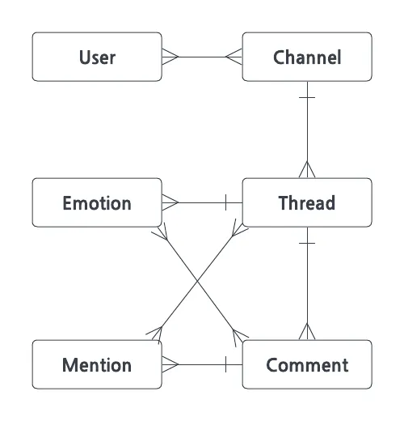
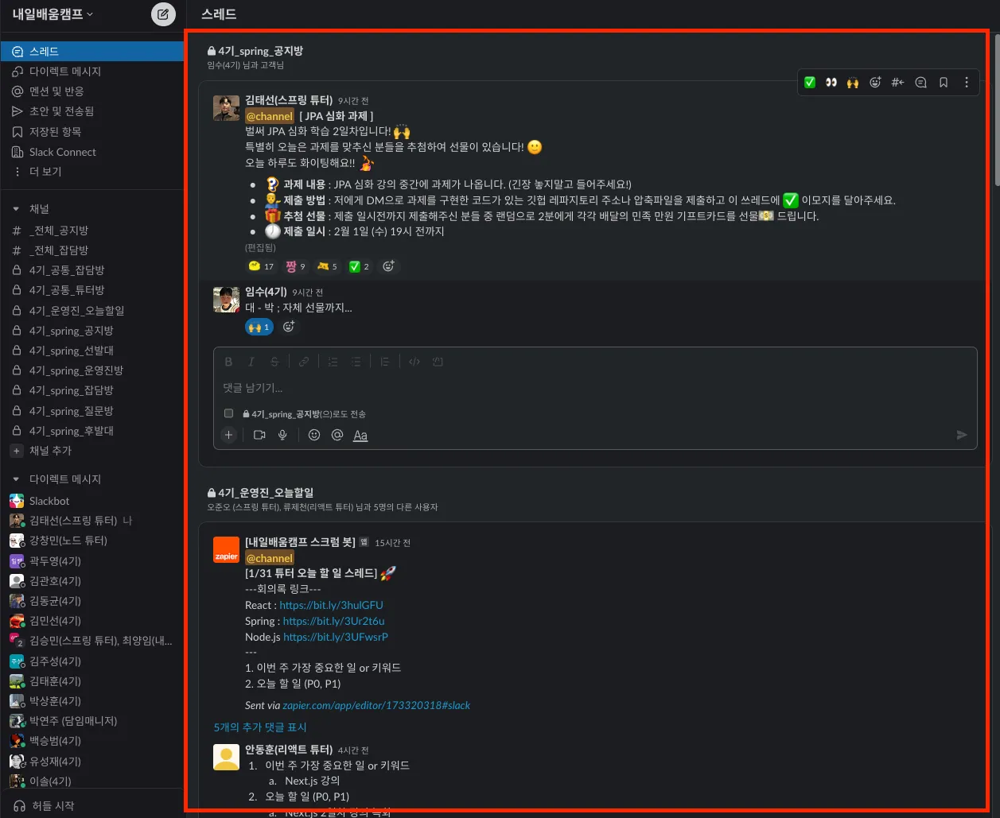
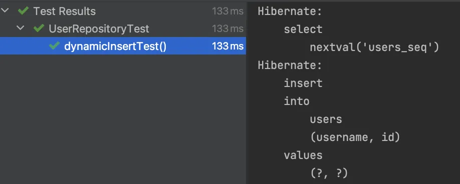
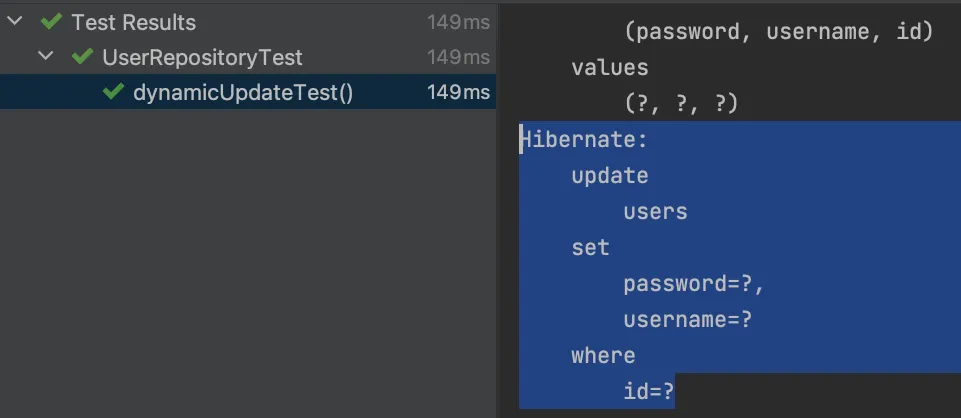
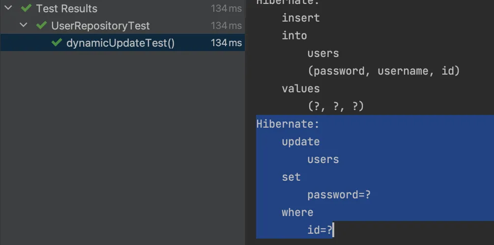

# 5주차 SpringData JPA 심화 🤾‍♀️


**[수업 목표]**

- QueryDSL을 사용하여 타입 안전 쿼리를 작성하는 방법을 배웁니다. 복잡한 조건과 정교한 쿼리를 쉽게 구성할 수 있는 기법을 소개합니다.
- Auditing을 사용하여 엔티티의 생성 및 수정 시간을 자동으로 관리하는 방법을 배웁니다. Spring Data JPA에서 제공하는 Auditing 기능을 통해 데이터의 일관성과 추적성을 확보합니다.
- Projection을 사용하여 필요한 데이터만 선택적으로 조회하는 방법을 배웁니다. 과도한 데이터 로드를 방지하고 성능을 최적화하는 기법을 학습합니다.


## ⭐ **01. 이번 주에 배울 것**

>  ✔️ SpringData JPA 와 함께 사용하는 쿼리생성 도구(QueryDSL), 그리고 SpringData JPA 에서 지원하는 자동세팅 기능(Auditing), 부분갱신 기능(Dynamic Insert/Update)에 대해서 학습하고 실습합니다.


## ❇️ **02.** 좀 더 멋지게 쿼리 생성하기 (QueryDSL)

### QueryDSL 소개

- Entity 의 매핑정보를 활용하여 쿼리에 적합하도록 **쿼리 전용 클래스(Q클래스)**로 재구성해주는 기술 입니다.
- 여기에 JPAQueryFactory 을 통한 **Q클래스**를 활용할 수 있는 기능들을 제공합니다.
- 그럼, JPAQueryFactory 는 뭘까요?
  - 재구성한 **Q클래스**를 통해 문자열이 아닌 객체 또는 함수로 쿼리를 작성하고 실행하게 해주는 기술 입니다.

```java
@PersistenceContext
EntityManager em;
 
public List<User> selectUserByUsernameAndPassword(String username, String password){
	JPAQueryFactory jqf = new JPAQueryFactory(em);
	QUser user = QUser.user;
  
	List<Person> userList = jpf
								.selectFrom(user)
								.where(person.username.eq(username)
									.and(person.password.eq(password))
								.fetch();
                                
	return userList;
}
```


### QueryDSL 적용 방법

슬랙 도메인을 다시한번 보면서 요구사항에 대한 쿼리를 작성해봅시다.



- User : 유저 정보로 채널과 관계만 양방향이고, 다른 도메인과는 단방향 관계를 가집니다.

- Channel : 대화 채널은 유저와 다대다 관계를 가진다.

- Thread : 채널내 대화 쓰레드로 Post 와 같이 댓글, 이모지, 멘션과 관계를 가진다.

- Comment : 쓰레드내 댓글로 쓰레드와 다대일 관계를 가지며 이모지, 멘션과도 관계를 가진다.

- Emotion : 쓰레드, 댓글내 이모지로 쓰레드, 댓글과 다대다 관계를 가집니다.

- Mention : 쓰레드, 댓글내 멘션으로 쓰레드, 댓글과 다대다 관계를 가집니다.

- **❤️‍🩹 JPAQueryFactory 사용을 위해 추가해야 할 코드**

  - JPAQueryFactory 에 entityManager 를 주입해서 Bean 으로 등록해줘야 합니다.

  ```java
  // configuration 패키지안에 추가
  
  @Configuration
  public class JPAConfiguration {
  
    @PersistenceContext
    private EntityManager entityManager;
  
    @Bean
    public JPAQueryFactory jpaQueryFactory() {
      return new JPAQueryFactory(entityManager);
    }
  }
  ```


## 요구사항. Slack 멘션된 쓰레드 목록 조회기능

전체 채널에서 내가 멘션된 쓰레드 상세정보 목록

- 기능 쿼리스펙 정의
  - 📄 조회문 (Select)
    - 채널명 (`Channel.name`)
    - 쓰레드 작성자명(`User.username`)
    - 쓰레드 작성자 프로필이미지(`User.profileImageUrl`)
    - 쓰레드 본문 (`Thread.message`)
    - 쓰레드 이모지 정보 (`Emotion.body`) + 이모지별 카운트
    - 쓰레드 댓글 목록 정보 (`Comment.message`)
      - 쓰레드 댓글목록의 이모지목록 정보 (`Emotion.body`) + 이모지별 카운트
  - 📌 조회 대상 (From)
    - 쓰레드 목록 (`Thread`)
  - 🔎 조건문 (Where)
    - 내가 멘션된 (`Mention`) 쓰레드 목록
  - 🥇 정렬문 (Order)
    - 멘션된 시간 기준 내림차순 (`Mention`)




## 📔 03. 테이블 객체 방명록 설정하기 (Auditing)

### Auditing 소개

- Auditing 을 사용하면 엔티티를 누가 언제 생성/마지막 수정 했는지 자동으로 기록되게 할 수 있다.
- 방명록처럼 ~~왔다감


이처럼 날짜와 작성자를 기록할 수 있습니다. 🤣

```java
@CreatedDate
private Date created;

@LastModifiedDate
private Date updated;

@CreatedBy
@ManyToOne
private Account createdBy;

@LastModifiedBy
@ManyToOne
private Account updatedBy;
```


### Auditing 적용 방법

1. 메인 애플리케이션 위에 `@EnableJpaAuditing` 추가

   ```java
   @EnableJpaAuditing
   @SpringBootApplication
   public class Application {
   ```

2. 엔티티 클래스 위에 `@EntityListeners(AuditingEntityListener.class)` 추가

   ```java
   @Getter
   @MappedSuperclass
   @EntityListeners(AuditingEntityListener.class)
   public class TimeStamp {
       @CreatedDate
       private LocalDateTime createdAt;
   
       @CreatedBy
       @ManyToOne
       private User createdBy;
   
       @LastModifiedDate
       private LocalDateTime modifiedAt;
   
       @LastModifiedBy
       @ManyToOne
       private User modifiedBy;
   }
   ```

3. AuditorAware 구현체 만들기

   1. createdAt, modifiedAt 은 구현체 없이 동작하지만 createdBy, modifiedBy 는 구현체가 필요하다.

   2. SpringSecurity 의 SecurityContextHolder 에서 인증정보 안에 담긴 UserDetailsImpl을 사용하여 user 객체를 가져와서 넣어준다.

      - SpringSecurity의 JwtFilter 에서 우리가 저장해주는 부분 코드보기

        ```java
        // JwtAuthFilter.java
        
        @Slf4j
        @RequiredArgsConstructor
        public class JwtAuthFilter extends OncePerRequestFilter {
        
            private final JwtUtil jwtUtil;
        
            @Override
            protected void doFilterInternal(HttpServletRequest request, HttpServletResponse response, FilterChain filterChain) throws ServletException, IOException {
                String token = jwtUtil.resolveToken(request);
        
                if(token != null) {
                    if(!jwtUtil.validateToken(token)){
                        jwtExceptionHandler(response, "Token Error", HttpStatus.UNAUTHORIZED.value());
                        return;
                    }
                    Claims info = jwtUtil.getUserInfoFromToken(token);
        						// 인증정보 세팅함수 호출
                    setAuthentication(info.getSubject());
                }
                try {
                    filterChain.doFilter(request, response);
                }catch(FileUploadException e){
                    jwtExceptionHandler(response,"File Upload Error",400);
                }
            }
        
            public void setAuthentication(String username) {
        				// SecurityContextHolder 는 threadLocal 로 구현되어 요청쓰레드내에서 공유할 수 있다.
                SecurityContext context = SecurityContextHolder.createEmptyContext();
                Authentication authentication = jwtUtil.createAuthentication(username);
        				// 요기서 인증정보(계정정보)를 담아준다.
                context.setAuthentication(authentication);
        
                SecurityContextHolder.setContext(context);
            }
        		...
        }
        ```

   ```java
   @Service
   public class UserAuditorAware implements AuditorAware<User> {
       @Override
       public Optional<User> getCurrentAuditor() {
           Authentication authentication = SecurityContextHolder.getContext().getAuthentication();
   			
           if (authentication == null || !authentication.isAuthenticated()) {
               return Optional.empty();
           }
   
           return Optional.of(((UserDetailsImpl) authentication.getPrincipal()).getUser());
       }
   }
   ```

4. @EnableJpaAuditing에 AuditorAware 빈 이름 설정하기.

   ```java
   @EnableJpaAuditing(auditorAwareRef = "userAuditorAware") // auditorAware 의 빈이름을 넣어준다.
   @SpringBootApplication
   public class Application {
   ```


## 🧨 04. 필요한 부분만 갱신하기 (Dynamic Insert/Update)

### @DynamicInsert

> 📌 이 어노테이션을 엔티티에 적용하게 되면 `Insert` 쿼리를 날릴 때 null 인 값은 제외하고 쿼리문이 만들어집니다.


- 적용 방법
  - Entity 에 **@DynamicInsert** 어노테이션을 붙여주면 끝!

```java
@DynamicInsert
	public class User {
  ...
}
```

- **테스트 실습 코드 스니펫**

```java
@Test
  void dynamicInsertTest() {
    // given
    var newUser = User.builder().username("user").build();

    // when
    userRepository.save(newUser);

    // then
    // 부분 생성 쿼리
  }
```

- **적용 전**

```java
Hibernate: 
    insert 
    into
        users
        (password, username, id) 
    values
        (?, ?, ?)  // 141ms 소요
```


- **적용 후**

```java
Hibernate: 
    insert 
    into
        users
        (username, id) 
    values
        (?, ?)  // 133ms 소요
```



- 적용 전/후 비교
  - 필드차이가 1개밖에 안되서 10ms 정도밖에 차이가 안나지만 필드가 많아질수록 더 차이가 많이납니다!

### **@DynamicUpdate**

> 📌 이 어노테이션을 엔티티에 적용하게 되면 `Update` 쿼리를 날릴 때 null인 값은 제외하고 쿼리문이 만들어집니다.


- **적용 방법**

```java
@DynamicUpdate
public class User {
  ...
}
```

- **테스트 실습 코드 스니펫**

```java
@Test
  void dynamicUpdateTest() {
    // given
    var newUser = User.builder().username("user").password("password").build();
    userRepository.save(newUser);

    // when
    newUser.updatePassword("new password");
    userRepository.save(newUser);

    // then
    // 부분 수정 쿼리
  }
```

- **적용 전**

```java
Hibernate: 
    update
        users 
    set
        password=?,
        username=? 
    where
        id=?  // 149ms
```



- **적용 후**

```java
Hibernate: 
    update
        users 
    set
        password=? 
    where
        id=?  // 134ms
```



- 적용 전/후 비교
  - 업데이트도 10ms 정도밖에 차이가 안나지만 필드가 많아질수록 더 차이가 많이납니다!

